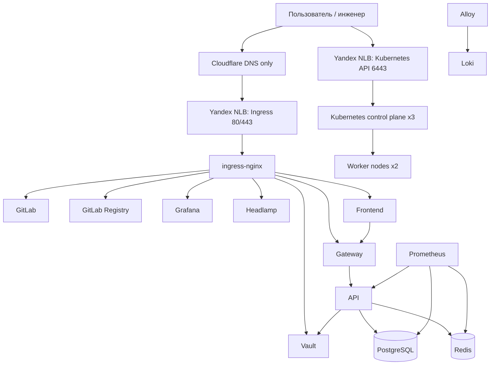

# K8s Cluster Deployment Kit

Репозиторий содержит практическую часть выпускной квалификационной работы по направлению подготовки
`09.04.03 Прикладная информатика`, магистерская программа `DevOps-инженерия`.

Автор: Павлютин Матвей Дмитриевич, группа `DevOps24-1м`, Финансовый университет при Правительстве
Российской Федерации, факультет ИТиАБД, кафедра информационных технологий. Москва 2026.

## Назначение проекта

Проект реализует переносимый deployment kit для воспроизводимого развертывания self-hosted
Kubernetes-кластера и прикладной платформы на виртуальной инфраструктуре Yandex Cloud.

Решение автоматизирует полный жизненный цикл стенда:

1. Подготовка Yandex Cloud и сервисного аккаунта для Terraform.
2. Создание инфраструктуры: сеть, подсеть, security group, виртуальные машины, публичные адреса и балансировщики.
3. Публикация DNS-записей через Cloudflare в режиме `DNS only`.
4. Bootstrap HA Kubernetes-кластера через kubeadm и Ansible.
5. Развертывание платформенных сервисов: ingress-nginx, cert-manager, мониторинг, логирование, админка Kubernetes.
6. Развертывание Vault, GitLab и Container Registry.
7. Сборка, публикация и деплой demo-приложений.
8. Приемочное тестирование стенда: smoke, network, integration, storage, GitLab, resilience, load, security.

## Ключевой результат

В рамках практического прогона был развернут стенд `vm-dev`:

| Параметр | Значение |
| --- | --- |
| Облако | Yandex Cloud |
| Домен | `pkhco.ru` |
| DNS | Cloudflare, `DNS only` |
| Kubernetes | kubeadm HA, `v1.29.3` |
| Узлы | 3 control plane + 2 worker |
| ОС узлов | Ubuntu 22.04.5 LTS |
| Runtime | containerd 2.2.1 |
| TLS | Production Let's Encrypt через `letsencrypt-prod` |
| Итог тестов | `19/19 OK` |

## Архитектурная схема



## Структура репозитория

```text
PROJECT DIPLOMA/
  README.md                 # входная страница проекта
  deployment-kit/           # основной код deployment kit
    ansible/                # bootstrap kubeadm-кластера и подготовка узлов
    apps/                   # demo-заглушки API, Gateway и Frontend
    ci/                     # Makefile-скрипты и автоматизация стадий
    diagrams/               # Mermaid и PlantUML диаграммы
    docs/                   # актуальная документация по проекту
    environments/           # параметры окружений
    kubernetes/             # Helm values, manifests, NetworkPolicy, observability
    terraform/              # IaC-слои: vm, edge, platform, vault, modules
    tests/                  # smoke, network, integration, storage, security, load
  execution-log/            # отчет о практическом тестировании deployment-kit
```

## Быстрая навигация

| Раздел | Ссылка |
| --- | --- |
| Навигация по документации | [deployment-kit/docs/README.md](deployment-kit/docs/README.md) |
| Обзор решения | [deployment-kit/docs/00-overview/overview.md](deployment-kit/docs/00-overview/overview.md) |
| Архитектура | [deployment-kit/docs/00-overview/architecture.md](deployment-kit/docs/00-overview/architecture.md) |
| Подготовка Yandex Cloud | [deployment-kit/docs/10-preparation/yandex-cloud-preparation.md](deployment-kit/docs/10-preparation/yandex-cloud-preparation.md) |
| Домены, TLS и CDN | [deployment-kit/docs/10-preparation/domain-cdn.md](deployment-kit/docs/10-preparation/domain-cdn.md) |
| Runbook запуска | [deployment-kit/docs/20-runbook/runbook.md](deployment-kit/docs/20-runbook/runbook.md) |
| Модель kubeadm-кластера | [deployment-kit/docs/20-runbook/kubeadm-cluster.md](deployment-kit/docs/20-runbook/kubeadm-cluster.md) |
| Наблюдаемость | [deployment-kit/docs/30-operations/observability.md](deployment-kit/docs/30-operations/observability.md) |
| Безопасность | [deployment-kit/docs/30-operations/security-model.md](deployment-kit/docs/30-operations/security-model.md) |
| Тестирование | [deployment-kit/docs/30-operations/testing.md](deployment-kit/docs/30-operations/testing.md) |
| Диаграммы | [deployment-kit/diagrams/README.md](deployment-kit/diagrams/README.md) |
| Отчет о практическом прогоне | [execution-log/README.md](execution-log/README.md) |

## Отчет о практической части

Каталог [execution-log](execution-log/README.md) содержит оформленный отчет по фактическому
развертыванию стенда. Отчет построен по этапам runbook:

| Этап | Отчет |
| --- | --- |
| Подготовка облака и доступа | [01-cloud-and-access.md](execution-log/01-cloud-and-access.md) |
| Статическая проверка | [02-local-validation.md](execution-log/02-local-validation.md) |
| Инфраструктура и DNS | [03-infrastructure-and-dns.md](execution-log/03-infrastructure-and-dns.md) |
| Bootstrap Kubernetes | [04-kubeadm-bootstrap.md](execution-log/04-kubeadm-bootstrap.md) |
| Platform services и Vault | [05-platform-and-vault.md](execution-log/05-platform-and-vault.md) |
| GitLab и Registry | [06-gitlab-registry.md](execution-log/06-gitlab-registry.md) |
| Прикладной контур | [07-application-contour.md](execution-log/07-application-contour.md) |
| Приемочные тесты | [08-test-results.md](execution-log/08-test-results.md) |
| Заключение | [09-conclusion.md](execution-log/09-conclusion.md) |
