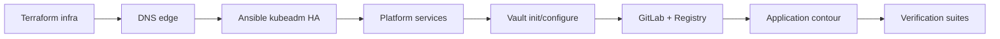

# Диаграммы deployment-kit

Каталог содержит актуальные схемы архитектуры, bootstrap-процесса, CI/CD, наблюдаемости, безопасности и тестирования.

## Mermaid

Mermaid-файлы можно просматривать в GitHub, GitLab и большинстве Markdown preview:

- [solution-context.mmd](solution-context.mmd) — контекст решения;
- [cluster-architecture.mmd](cluster-architecture.mmd) — целевая архитектура кластера;
- [deployment-sequence.mmd](deployment-sequence.mmd) — порядок запуска deployment-kit;
- [ci-cd-flow.mmd](ci-cd-flow.mmd) — pipeline сборки и деплоя приложений;
- [observability-security.mmd](observability-security.mmd) — связка мониторинга, логов и security baseline;
- [testing-matrix.mmd](testing-matrix.mmd) — покрытие тестами.

## PlantUML

Файлы `*.puml` оставлены для экспорта в PNG/SVG/PDF и вставки в практическую часть ВКР.

Пример рендера:

```bash
plantuml -tsvg diagrams/*.puml
```

## Актуальная последовательность запуска


