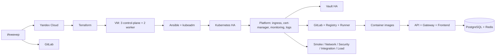
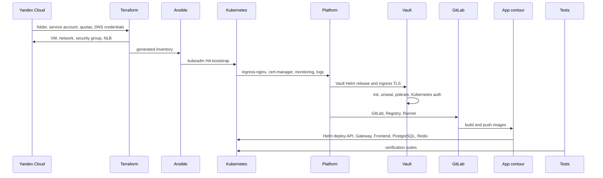

# Документация deployment-kit

Данный раздел является навигационной картой документации. Документы сгруппированы по жизненному циклу deployment-kit: от архитектуры и подготовки облака до эксплуатации, тестирования и отчёта по практическому запуску.

## Структура документации

```text
docs/
  README.md                         # навигация по документации
  00-overview/                      # архитектура, состав решения, версии и окружения
  10-preparation/                   # подготовка Yandex Cloud, DNS, TLS и CDN
  20-runbook/                       # пошаговый запуск, kubeadm, backup/restore
  30-operations/                    # наблюдаемость, безопасность и тестирование
  40-audit/                         # аудит готовности и служебные материалы
```

## Что читать в первую очередь

| Задача | Документ |
| --- | --- |
| Понять назначение проекта | [Обзор](00-overview/overview.md) |
| Понять архитектуру решения | [Архитектура](00-overview/architecture.md) |
| Подготовить Yandex Cloud | [Подготовка Yandex Cloud](10-preparation/yandex-cloud-preparation.md) |
| Настроить домен и TLS | [Домены, TLS и CDN](10-preparation/domain-cdn.md) |
| Запустить стенд с нуля | [Runbook запуска и тестирования](20-runbook/runbook.md) |
| Понять kubeadm bootstrap | [Модель kubeadm-кластера](20-runbook/kubeadm-cluster.md) |
| Проверить мониторинг | [Модель наблюдаемости](30-operations/observability.md) |
| Проверить безопасность | [Модель безопасности](30-operations/security-model.md) |
| Запустить тесты | [Модель тестирования](30-operations/testing.md) |
| Зафиксировать версии | [Версии компонентов](00-overview/versions.md) |
| Оценить готовность | [Аудит готовности](40-audit/readiness-audit.md) |

## Общая схема решения



## Поток запуска



## Диаграммы

Актуальные диаграммы расположены в [../diagrams](../diagrams). Для GitHub и Markdown-ориентированного просмотра используются Mermaid-файлы `*.mmd`; для вставки в ВКР через PlantUML сохранены `*.puml`.

## Отчёт о практическом запуске

Нормализованный отчёт по фактическому запуску и тестированию находится в [../../execution-log](../../execution-log) на уровне корня репозитория. Исходный файл `final_log` используется только как локальный сырой журнал и не предназначен для коммита.
