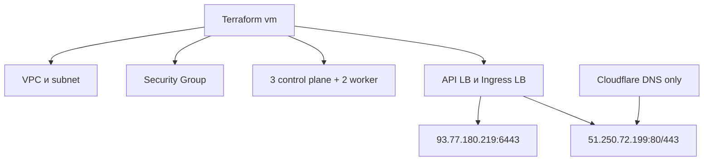

# Этап 3. Инфраструктура Yandex Cloud и DNS

## Цель этапа

Создать базовую инфраструктуру стенда: VPC, подсеть, security group, пять виртуальных машин,
публичные адреса и балансировщики. После создания инфраструктуры привязать публичные поддомены
`pkhco.ru` к ingress IP через Cloudflare в режиме `DNS only`.

## Планирование инфраструктуры

```bash
make infra-plan ENV=vm-dev
```

Значимый вывод:

```text
Terraform used the selected providers to generate the following execution plan.
Resource actions are indicated with the following symbols:
  + create

module.compute.yandex_compute_instance.control_plane["mdp-cp-01"] will be created
module.compute.yandex_compute_instance.control_plane["mdp-cp-02"] will be created
module.compute.yandex_compute_instance.control_plane["mdp-cp-03"] will be created
module.compute.yandex_compute_instance.worker["mdp-worker-01"] will be created
module.compute.yandex_compute_instance.worker["mdp-worker-02"] will be created
```

## Применение инфраструктуры

```bash
make infra-apply ENV=vm-dev
```

Контрольные outputs после применения:

```bash
jq '.api_external_ip.value, .ingress_external_ip.value, .control_planes.value, .workers.value' \
  .artifacts/vm-dev/terraform-outputs.json
```

Значимый вывод:

```text
"93.77.180.219"
"51.250.72.199"

control planes:
  mdp-cp-01: 10.10.10.10, ansible_host 93.77.180.209
  mdp-cp-02: 10.10.10.11, ansible_host 111.88.252.5
  mdp-cp-03: 10.10.10.12, ansible_host 111.88.253.42

workers:
  mdp-worker-01: 10.10.10.20, ansible_host 89.169.132.91
  mdp-worker-02: 10.10.10.21, ansible_host 111.88.252.20
```

## DNS через Cloudflare

```bash
make edge-apply ENV=vm-dev
```

В Cloudflare были созданы A-записи, указывающие на ingress IP `51.250.72.199`.
Проксирование Cloudflare отключено, чтобы внешний трафик шел напрямую на ingress NLB.

| Hostname | IP | Режим |
| --- | --- | --- |
| `api.pkhco.ru` | `51.250.72.199` | DNS only |
| `app.pkhco.ru` | `51.250.72.199` | DNS only |
| `gateway.pkhco.ru` | `51.250.72.199` | DNS only |
| `gitlab.pkhco.ru` | `51.250.72.199` | DNS only |
| `grafana.pkhco.ru` | `51.250.72.199` | DNS only |
| `k8s-admin.pkhco.ru` | `51.250.72.199` | DNS only |
| `kas.pkhco.ru` | `51.250.72.199` | DNS only |
| `minio.pkhco.ru` | `51.250.72.199` | DNS only |
| `registry.pkhco.ru` | `51.250.72.199` | DNS only |
| `vault.pkhco.ru` | `51.250.72.199` | DNS only |

## Схема этапа



## Результат этапа

<span style="color:#16833a"><strong>Успешно.</strong></span> Инфраструктура создана, outputs
сохранены в `.artifacts/vm-dev/terraform-outputs.json`, публичные DNS-записи указывают на ingress
балансировщик.

