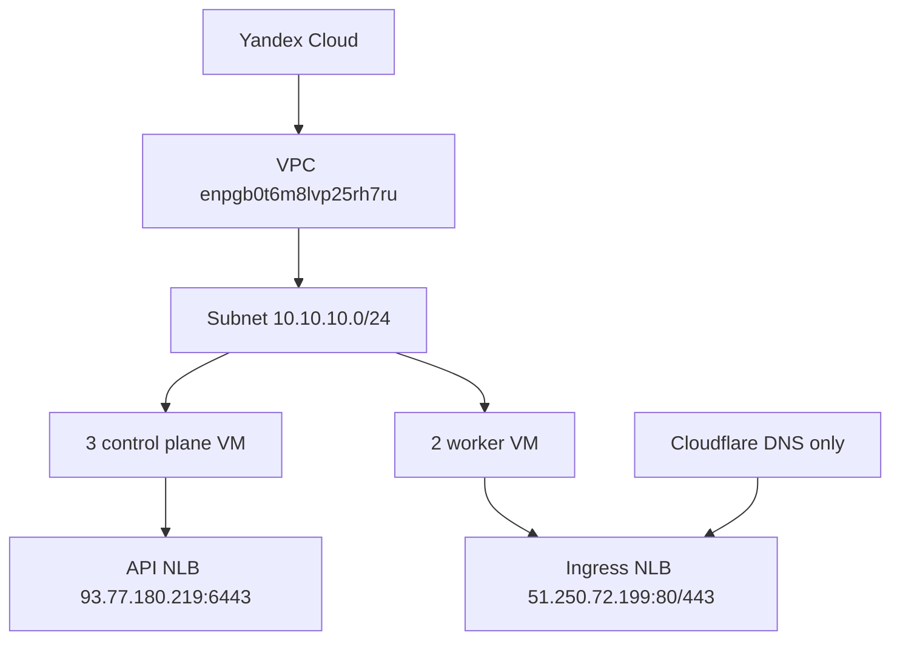

# Этап 3. Создание инфраструктуры и DNS-записей

## Назначение этапа

На этом этапе Terraform создает инфраструктурный слой Yandex Cloud и edge-записи Cloudflare:
VPC, подсеть, security group, пять виртуальных машин, внешний балансировщик Kubernetes API,
внешний ingress-балансировщик и A-записи для публичного домена `pkhco.ru`.

<span style="color:#16833a"><strong>Итог этапа:</strong></span> инфраструктура создана,
Cloudflare DNS-записи указывают на ingress IP `51.250.72.199`, Ansible inventory сформирован.

## 3.1. Планирование инфраструктуры Yandex Cloud

### Команда

```bash
make infra-plan ENV=vm-dev
```

### Зачем запускалась

Команда запускает Terraform plan для `terraform/vm`. Она нужна для проверки состава создаваемых
ресурсов до фактического изменения облака.

### Вывод

```text
./ci/scripts/terraform-plan.sh vm-dev
Initializing the backend...
Initializing modules...
Initializing provider plugins...
- terraform.io/builtin/terraform is built in to Terraform
- Reusing previous version of yandex-cloud/yandex from the dependency lock file
- Using previously-installed yandex-cloud/yandex v0.201.0

Terraform has been successfully initialized!

module.compute.data.yandex_compute_image.base: Reading...
module.compute.data.yandex_compute_image.base: Read complete after 0s [id=fd8aa7pf6t38pial7g03]

Terraform used the selected providers to generate the following execution plan.
Resource actions are indicated with the following symbols:
  + create
```

Фрагмент плана по control plane узлу:

```text
# module.compute.yandex_compute_instance.control_plane["mdp-cp-01"] will be created
+ resource "yandex_compute_instance" "control_plane" {
    + hostname = "mdp-cp-01"
    + name     = "mdp-cp-01"
    + zone     = "ru-central1-a"

    + metadata = {
        + "serial-port-enable" = "1"
        + "ssh-keys"           = "ubuntu:ssh-ed25519 ... deployment-kit-yc"
      }

    + network_interface {
        + ip_address = "10.10.10.10"
        + ipv4       = true
        + nat        = true
      }

    + resources {
        + core_fraction = 100
        + cores         = 2
        + memory        = 4
      }
  }
```

Фрагмент плана по worker-узлу:

```text
# module.compute.yandex_compute_instance.worker["mdp-worker-01"] will be created
+ resource "yandex_compute_instance" "worker" {
    + hostname = "mdp-worker-01"
    + name     = "mdp-worker-01"

    + network_interface {
        + ip_address = "10.10.10.20"
        + nat        = true
      }

    + resources {
        + core_fraction = 100
        + cores         = 4
        + memory        = 8
      }
  }
```

### Вывод по plan

План подтвердил создание HA-топологии: 3 control plane узла, 2 worker-узла, VPC/subnet, security
group, target groups, network load balancers и outputs для Ansible inventory.

## 3.2. Применение инфраструктуры

### Команда

```bash
make infra-apply ENV=vm-dev
```

### Зачем запускалась

Команда применяет Terraform-конфигурацию `terraform/vm` и фактически создает инфраструктуру в
Yandex Cloud.

### Вывод

```text
./ci/scripts/terraform-apply.sh vm-dev
Initializing the backend...
Initializing modules...
Initializing provider plugins...
- terraform.io/builtin/terraform is built in to Terraform
- Reusing previous version of yandex-cloud/yandex from the dependency lock file
- Using previously-installed yandex-cloud/yandex v0.201.0

Terraform has been successfully initialized!
```

Во время refresh Terraform обнаружил, что часть ресурсов была удалена вне Terraform, и пересоздал
нужные объекты:

```text
Note: Objects have changed outside of Terraform

Terraform detected the following changes made outside of Terraform since the last "terraform apply":

  # module.network.yandex_vpc_subnet.this has been deleted
  - resource "yandex_vpc_subnet" "this" {
      - id = "e9ba0m7v2v3ockvbqdl7" -> null
        name = "mdp-k8s-dev-subnet"
    }
```

Фактическое создание ресурсов:

```text
Plan: 11 to add, 0 to change, 0 to destroy.

module.network.yandex_vpc_subnet.this: Creating...
module.load_balancer.yandex_vpc_address.ingress: Creating...
module.network.yandex_vpc_subnet.this: Creation complete after 1s [id=e9b893bjanasigpcpm3v]
module.compute.yandex_compute_instance.control_plane["mdp-cp-02"]: Creating...
module.compute.yandex_compute_instance.control_plane["mdp-cp-01"]: Creating...
module.compute.yandex_compute_instance.worker["mdp-worker-01"]: Creating...
module.compute.yandex_compute_instance.worker["mdp-worker-02"]: Creating...
module.compute.yandex_compute_instance.control_plane["mdp-cp-03"]: Creating...
module.load_balancer.yandex_vpc_address.ingress: Creation complete after 2s [id=e9bpchnhs8garkku3rbe]
```

Продолжение создания ВМ и балансировщиков:

```text
module.compute.yandex_compute_instance.worker["mdp-worker-02"]: Creation complete after 47s [id=fhm0ogj85usfcjod7fe7]
module.compute.yandex_compute_instance.control_plane["mdp-cp-01"]: Creation complete after 50s [id=fhmso366co1q833rgh69]
module.compute.yandex_compute_instance.control_plane["mdp-cp-03"]: Creation complete after 51s [id=fhmo2comthp5c4ifdrkp]
module.compute.yandex_compute_instance.worker["mdp-worker-01"]: Creation complete after 58s [id=fhmdu306prqk3vd4lf6b]
module.compute.yandex_compute_instance.control_plane["mdp-cp-02"]: Creation complete after 1m4s [id=fhmcvtev9ovrqvlpuuub]
module.load_balancer.yandex_lb_network_load_balancer.ingress: Creation complete after 5s [id=enpafvu7f7ebm65lg2sm]
module.load_balancer.yandex_lb_network_load_balancer.api: Creation complete after 4s [id=enpm04k2fr05e8qsspva]

Apply complete! Resources: 11 added, 0 changed, 0 destroyed.
```

### Outputs Terraform

```text
api_external_ip = "93.77.180.219"
api_load_balancer_id = "enpm04k2fr05e8qsspva"
control_plane_vip = "93.77.180.219"
ingress_external_ip = "51.250.72.199"
ingress_load_balancer_id = "enpafvu7f7ebm65lg2sm"
network_id = "enpgb0t6m8lvp25rh7ru"
security_group_id = "enpat17b1l2vrddvksvf"
subnet_id = "e9b893bjanasigpcpm3v"
```

Сформированные узлы:

```text
control_planes = [
  {
    "ansible_host" = "93.77.180.209"
    "fqdn" = "mdp-cp-01.ru-central1.internal"
    "ip" = "10.10.10.10"
    "name" = "mdp-cp-01"
  },
  {
    "ansible_host" = "111.88.252.5"
    "fqdn" = "mdp-cp-02.ru-central1.internal"
    "ip" = "10.10.10.11"
    "name" = "mdp-cp-02"
  },
  {
    "ansible_host" = "111.88.253.42"
    "fqdn" = "mdp-cp-03.ru-central1.internal"
    "ip" = "10.10.10.12"
    "name" = "mdp-cp-03"
  },
]

workers = [
  {
    "ansible_host" = "89.169.132.91"
    "fqdn" = "mdp-worker-01.ru-central1.internal"
    "ip" = "10.10.10.20"
    "name" = "mdp-worker-01"
  },
  {
    "ansible_host" = "111.88.252.20"
    "fqdn" = "mdp-worker-02.ru-central1.internal"
    "ip" = "10.10.10.21"
    "name" = "mdp-worker-02"
  },
]
```

## 3.3. Проверка outputs через jq

### Команда

```bash
jq '.api_external_ip.value, .ingress_external_ip.value, .control_planes.value, .workers.value' \
  .artifacts/vm-dev/terraform-outputs.json
```

### Зачем запускалась

Команда проверяет сохраненный JSON outputs, который используется последующими скриптами для
генерации inventory, hosts-файлов и параметров деплоя.

### Вывод

```text
"93.77.180.219"
"51.250.72.199"
[
  {
    "ansible_host": "93.77.180.209",
    "fqdn": "mdp-cp-01.ru-central1.internal",
    "ip": "10.10.10.10",
    "name": "mdp-cp-01"
  },
  {
    "ansible_host": "111.88.252.5",
    "fqdn": "mdp-cp-02.ru-central1.internal",
    "ip": "10.10.10.11",
    "name": "mdp-cp-02"
  },
  {
    "ansible_host": "111.88.253.42",
    "fqdn": "mdp-cp-03.ru-central1.internal",
    "ip": "10.10.10.12",
    "name": "mdp-cp-03"
  }
]
[
  {
    "ansible_host": "89.169.132.91",
    "fqdn": "mdp-worker-01.ru-central1.internal",
    "ip": "10.10.10.20",
    "name": "mdp-worker-01"
  },
  {
    "ansible_host": "111.88.252.20",
    "fqdn": "mdp-worker-02.ru-central1.internal",
    "ip": "10.10.10.21",
    "name": "mdp-worker-02"
  }
]
```

## 3.4. Создание DNS-записей Cloudflare

### Команда

```bash
make edge-apply ENV=vm-dev
```

### Зачем запускалась

Команда применяет Terraform edge-слой и создает Cloudflare A-записи для всех публичных endpoints
стенда. Режим Cloudflare — `DNS only`, без proxy.

### Вывод

```text
./ci/scripts/edge-apply.sh vm-dev
Initializing the backend...
Initializing provider plugins...
- Reusing previous version of yandex-cloud/yandex from the dependency lock file
- Reusing previous version of cloudflare/cloudflare from the dependency lock file
- Using previously-installed yandex-cloud/yandex v0.201.0
- Using previously-installed cloudflare/cloudflare v4.52.7

Terraform has been successfully initialized!

Terraform used the selected providers to generate the following execution plan.
Resource actions are indicated with the following symbols:
  + create
```

Фрагмент плана записи:

```text
# cloudflare_record.ingress_a["app.pkhco.ru"] will be created
+ resource "cloudflare_record" "ingress_a" {
    + content = "51.250.72.199"
    + name    = "app"
    + proxied = false
    + ttl     = 300
    + type    = "A"
    + zone_id = "fe3a0f92b4ef087e25730d9c436faf5b"
  }
```

Список создаваемых записей:

```text
Plan: 10 to add, 0 to change, 0 to destroy.

cloudflare_record.ingress_a["registry.pkhco.ru"]: Creating...
cloudflare_record.ingress_a["gateway.pkhco.ru"]: Creating...
cloudflare_record.ingress_a["kas.pkhco.ru"]: Creating...
cloudflare_record.ingress_a["minio.pkhco.ru"]: Creating...
cloudflare_record.ingress_a["app.pkhco.ru"]: Creating...
cloudflare_record.ingress_a["gitlab.pkhco.ru"]: Creating...
cloudflare_record.ingress_a["k8s-admin.pkhco.ru"]: Creating...
cloudflare_record.ingress_a["grafana.pkhco.ru"]: Creating...
cloudflare_record.ingress_a["api.pkhco.ru"]: Creating...
cloudflare_record.ingress_a["vault.pkhco.ru"]: Creating...
```

Завершение создания:

```text
cloudflare_record.ingress_a["kas.pkhco.ru"]: Creation complete after 2s [id=15264eba52e25b9687c437207e2edb72]
cloudflare_record.ingress_a["grafana.pkhco.ru"]: Creation complete after 3s [id=1c82c50f72a71daf032a9eeea013a23e]
cloudflare_record.ingress_a["registry.pkhco.ru"]: Creation complete after 3s [id=b76454ec55bb590e72a54b34217c79e6]
cloudflare_record.ingress_a["minio.pkhco.ru"]: Creation complete after 3s [id=840b9e23485c578b155b6317dbdb4279]
cloudflare_record.ingress_a["k8s-admin.pkhco.ru"]: Creation complete after 3s [id=9a9e6869c2b61f183beec78e7ea71e91]
cloudflare_record.ingress_a["app.pkhco.ru"]: Creation complete after 4s [id=0bbc7152af94abf568a40d18beac7644]
cloudflare_record.ingress_a["gateway.pkhco.ru"]: Creation complete after 4s [id=0e91486d49ed3bde7bc4104a9281ef63]
cloudflare_record.ingress_a["gitlab.pkhco.ru"]: Creation complete after 4s [id=74c61b7d2fa9501b70f7141598bad38b]
cloudflare_record.ingress_a["vault.pkhco.ru"]: Creation complete after 4s [id=1b0ec7d5f5c0bde4927e589cf4529bd9]
cloudflare_record.ingress_a["api.pkhco.ru"]: Creation complete after 5s [id=f1ec2780931cb998818e2a7f8c57b7e4]

Apply complete! Resources: 10 added, 0 changed, 0 destroyed.
```

### Outputs edge-слоя

```text
cloudflare_record_hostnames = tolist([
  "api.pkhco.ru",
  "app.pkhco.ru",
  "gateway.pkhco.ru",
  "gitlab.pkhco.ru",
  "grafana.pkhco.ru",
  "k8s-admin.pkhco.ru",
  "kas.pkhco.ru",
  "minio.pkhco.ru",
  "registry.pkhco.ru",
  "vault.pkhco.ru",
])

domain_name = "pkhco.ru"
```

## 3.5. Проверка локального hosts-файла

### Команда

```bash
cat .artifacts/vm-dev/hosts-file
```

### Зачем запускалась

Файл формируется как локальный артефакт с теми же hostnames, что были созданы в Cloudflare.
Он полезен для диагностики DNS и ручной проверки.

### Вывод

```text
51.250.72.199 api.pkhco.ru
51.250.72.199 app.pkhco.ru
51.250.72.199 gateway.pkhco.ru
51.250.72.199 gitlab.pkhco.ru
51.250.72.199 grafana.pkhco.ru
51.250.72.199 k8s-admin.pkhco.ru
51.250.72.199 kas.pkhco.ru
51.250.72.199 minio.pkhco.ru
51.250.72.199 registry.pkhco.ru
51.250.72.199 vault.pkhco.ru
```

## 3.6. Проверка SSH-доступа Ansible

### Команда

```bash
ansible -i ansible/inventory/generated/hosts.yml all -m ping
```

### Зачем запускалась

Команда проверяет, что сгенерированный inventory корректен, публичные адреса ВМ доступны, SSH-ключ
подходит, пользователь `ubuntu` существует, Python на ВМ доступен.

### Вывод

```text
mdp-worker-02 | SUCCESS => {
    "ansible_facts": {
        "discovered_interpreter_python": "/usr/bin/python3.10"
    },
    "changed": false,
    "ping": "pong"
}
mdp-worker-01 | SUCCESS => {
    "ansible_facts": {
        "discovered_interpreter_python": "/usr/bin/python3.10"
    },
    "changed": false,
    "ping": "pong"
}
mdp-cp-03 | SUCCESS => {
    "ansible_facts": {
        "discovered_interpreter_python": "/usr/bin/python3.10"
    },
    "changed": false,
    "ping": "pong"
}
mdp-cp-02 | SUCCESS => {
    "ansible_facts": {
        "discovered_interpreter_python": "/usr/bin/python3.10"
    },
    "changed": false,
    "ping": "pong"
}
mdp-cp-01 | SUCCESS => {
    "ansible_facts": {
        "discovered_interpreter_python": "/usr/bin/python3.10"
    },
    "changed": false,
    "ping": "pong"
}
```

## Схема результата этапа



## Результат этапа

<span style="color:#16833a"><strong>Успешно.</strong></span> Инфраструктура создана,
DNS-записи опубликованы, Ansible имеет доступ ко всем пяти узлам.

