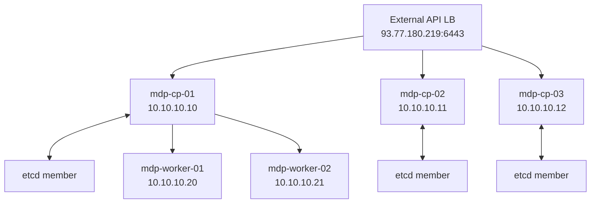

# Этап 4. Bootstrap Kubernetes-кластера

## Цель этапа

Развернуть self-hosted Kubernetes-кластер через kubeadm: три control plane узла, два worker-узла,
HA endpoint Kubernetes API через внешний балансировщик и CNI с поддержкой NetworkPolicy.

## Проверка SSH-доступа

Перед bootstrap выполнялась проверка доступности узлов через Ansible:

```bash
ansible -i ansible/inventory/generated/hosts.yml all -m ping
```

Назначение проверки: подтвердить, что Terraform outputs преобразованы в inventory корректно, SSH
ключи и пользователь `ubuntu` работают на всех созданных ВМ.

## Запуск bootstrap

```bash
make kubeadm-bootstrap ENV=vm-dev
```

В рамках команды выполнены:

| Блок | Назначение |
| --- | --- |
| `common` | Базовая подготовка ОС, hostname, sysctl, отключение swap. |
| `container_runtime` | Установка и настройка containerd. |
| `kubernetes_packages` | Установка kubeadm, kubelet, kubectl. |
| `kernel_prereqs` | Настройка модулей ядра и сетевых параметров. |
| `kubeadm_init` | Инициализация первого control plane узла. |
| `kubeadm_join_control_plane` | Подключение оставшихся control plane узлов. |
| `kubeadm_join_worker` | Подключение worker-узлов. |
| `cni` | Установка CNI и подготовка сетевой политики. |
| `kubeconfig` | Экспорт kubeconfig в `.artifacts/vm-dev/admin.conf`. |

## Проверка узлов

```bash
export KUBECONFIG=.artifacts/vm-dev/admin.conf
kubectl get nodes -o wide
```

Значимый вывод:

```text
NAME                                 STATUS   ROLES           VERSION   INTERNAL-IP
mdp-cp-01.ru-central1.internal       Ready    control-plane   v1.29.3   10.10.10.10
mdp-cp-02.ru-central1.internal       Ready    control-plane   v1.29.3   10.10.10.11
mdp-cp-03.ru-central1.internal       Ready    control-plane   v1.29.3   10.10.10.12
mdp-worker-01.ru-central1.internal   Ready    worker          v1.29.3   10.10.10.20
mdp-worker-02.ru-central1.internal   Ready    worker          v1.29.3   10.10.10.21
```

## Проверка системных Pod'ов

```bash
kubectl -n kube-system get pods -o wide
```

Значимый вывод:

```text
coredns                                      1/1 Running
etcd-mdp-cp-01.ru-central1.internal          1/1 Running
etcd-mdp-cp-02.ru-central1.internal          1/1 Running
etcd-mdp-cp-03.ru-central1.internal          1/1 Running
kube-apiserver-mdp-cp-01.ru-central1.internal 1/1 Running
kube-apiserver-mdp-cp-02.ru-central1.internal 1/1 Running
kube-apiserver-mdp-cp-03.ru-central1.internal 1/1 Running
kube-controller-manager-*                    1/1 Running
kube-proxy-*                                 1/1 Running
kube-scheduler-*                             1/1 Running
```

## Проверка готовности API

```bash
kubectl get --raw='/readyz?verbose'
```

Значимый вывод:

```text
[+]ping ok
[+]etcd ok
[+]etcd-readiness ok
[+]informer-sync ok
[+]shutdown ok
readyz check passed
```

## Схема результата



## Результат этапа

<span style="color:#16833a"><strong>Успешно.</strong></span> Kubernetes-кластер развернут в HA
топологии, все пять узлов находятся в состоянии `Ready`, системные компоненты запущены, API
возвращает `readyz check passed`.

