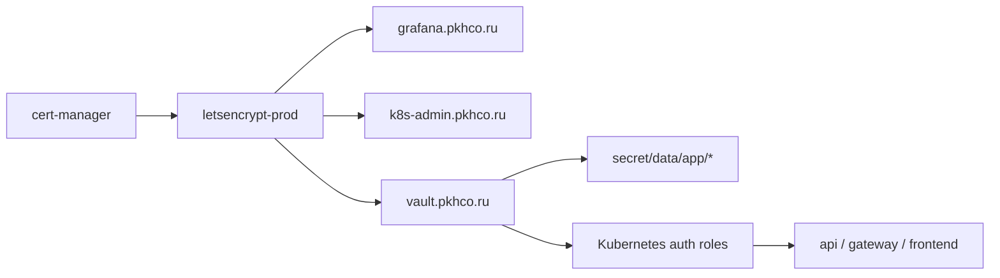

# Этап 5. Платформенные сервисы и Vault

## Цель этапа

Сначала развернуть платформенные компоненты, необходимые всему стенду: storage class, ingress-nginx,
cert-manager, production Let's Encrypt issuer, мониторинг, логирование и админку Kubernetes.
После этого развернуть Vault в HA-режиме с TLS-сертификатом от Let's Encrypt.

## Развертывание платформенных сервисов

```bash
make deploy-platform ENV=vm-dev
```

Значимые действия:

```text
namespace/platform created
namespace/observability created
namespace/app created
namespace/security created
namespace/devops created
namespace/ci created
namespace/k8s-admin created

deployment "local-path-provisioner" successfully rolled out
Release "cert-manager" does not exist. Installing it now.
clusterissuer.cert-manager.io/letsencrypt-prod created
clusterissuer.cert-manager.io/letsencrypt-prod condition met
Release "kube-prometheus-stack" does not exist. Installing it now.
Release "ingress-nginx" does not exist. Installing it now.
Release "metrics-server" does not exist. Installing it now.
Release "blackbox-exporter" does not exist. Installing it now.
Release "loki" does not exist. Installing it now.
Release "alloy" does not exist. Installing it now.
Release "headlamp" does not exist. Installing it now.
certificate.cert-manager.io/headlamp-tls condition met
certificate.cert-manager.io/grafana-tls condition met
```

Контрольный вывод:

```text
NAME               READY   AGE
letsencrypt-prod   True    6m26s
```

## Состав платформенного контура

| Компонент | Namespace | Назначение |
| --- | --- | --- |
| local-path-provisioner | `local-path-storage` | Динамическое локальное хранилище для dev-стенда. |
| cert-manager | `cert-manager` | Выпуск production Let's Encrypt сертификатов. |
| ingress-nginx | `ingress-nginx` | Внешний HTTP/HTTPS вход на NodePort за Yandex NLB. |
| kube-prometheus-stack | `observability` | Prometheus, Grafana, Alertmanager, kube-state-metrics. |
| Loki и Alloy | `observability` | Централизованный сбор и просмотр логов. |
| blackbox-exporter | `observability` | Проверка внешних HTTP endpoints. |
| Headlamp | `k8s-admin` | Веб-админка Kubernetes. |

## Развертывание Vault

```bash
make deploy-vault ENV=vm-dev
```

Значимый вывод:

```text
deployment "local-path-provisioner" successfully rolled out
helm_release.vault: Creation complete
persistentvolumeclaim/audit-vault-0   Bound
persistentvolumeclaim/audit-vault-1   Bound
persistentvolumeclaim/audit-vault-2   Bound
persistentvolumeclaim/data-vault-0    Bound
persistentvolumeclaim/data-vault-1    Bound
persistentvolumeclaim/data-vault-2    Bound
certificate.cert-manager.io/vault-tls condition met
```

## Инициализация Vault

```bash
make vault-init ENV=vm-dev
```

Значимый вывод:

```text
pod/vault-0 condition met
Vault initialized, bootstrap material saved to .artifacts/vm-dev/vault-init.json
vault-0   1/1 Running
vault-1   1/1 Running
vault-2   1/1 Running
```

## Конфигурация Vault для приложений

```bash
make vault-configure ENV=vm-dev
```

Значимый вывод:

```text
Apply complete! Resources: 9 added, 3 changed, 0 destroyed.

Outputs:
configured_vault_roles = [
  "api",
  "frontend",
  "gateway",
]
kubernetes_auth_path = "kubernetes"
kv_mount_path = "secret"
```

## Схема этапа



## Результат этапа

<span style="color:#16833a"><strong>Успешно.</strong></span> Платформенный слой и Vault
развернуты. Сертификаты публичных endpoints выпущены через `letsencrypt-prod`; непродуктивные
режимы выпуска сертификатов для публичного стенда не используются.
