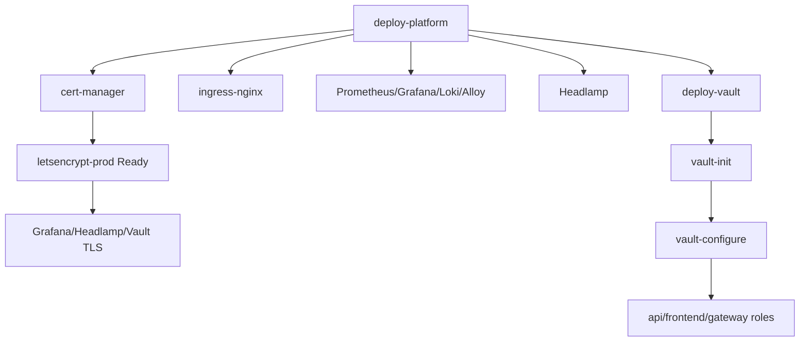

# Этап 5. Платформенные сервисы и Vault

## Назначение этапа

Этап устанавливает базовый платформенный слой Kubernetes: namespaces, storage class,
cert-manager с production Let's Encrypt issuer, ingress-nginx, мониторинг, логирование,
Grafana dashboards, Headlamp. После этого устанавливается Vault HA, выполняется `init/unseal` и
настраиваются Kubernetes auth, политики и KV v2 secrets engine.

<span style="color:#16833a"><strong>Итог этапа:</strong></span> platform services установлены,
`letsencrypt-prod` готов, Vault развернут и настроен для приложений `api`, `frontend`, `gateway`.

## 5.1. Развертывание платформенных сервисов

### Команда

```bash
make deploy-platform ENV=vm-dev
```

### Зачем запускалась

Команда создает базовый Kubernetes-платформенный слой, без которого невозможен корректный публичный
деплой приложений: ingress, TLS, monitoring, logging, storage и админка Kubernetes.

### Вывод: создание namespaces, storage и базовых secret

```text
./ci/scripts/deploy-platform.sh vm-dev
namespace/platform created
namespace/observability created
namespace/app created
namespace/security created
namespace/devops created
namespace/ci created
namespace/k8s-admin created
namespace/local-path-storage created
serviceaccount/local-path-provisioner-service-account created
clusterrole.rbac.authorization.k8s.io/local-path-provisioner-role created
clusterrolebinding.rbac.authorization.k8s.io/local-path-provisioner-bind created
configmap/local-path-config created
deployment.apps/local-path-provisioner created
storageclass.storage.k8s.io/local-path created
Waiting for deployment "local-path-provisioner" rollout to finish: 0 of 1 updated replicas are available...
deployment "local-path-provisioner" successfully rolled out
secret/grafana-admin created
namespace/k8s-admin configured
secret/headlamp-basic-auth created
```

Секреты `grafana-admin` и `headlamp-basic-auth` созданы, но их значения не выводились и в отчет не
переносятся.

### Вывод: обновление Helm repositories

```text
Hang tight while we grab the latest from your chart repositories...
...Successfully got an update from the "metrics-server" chart repository
...Successfully got an update from the "headlamp" chart repository
...Successfully got an update from the "ingress-nginx" chart repository
...Successfully got an update from the "hashicorp" chart repository
...Successfully got an update from the "jetstack" chart repository
...Successfully got an update from the "prometheus-community" chart repository
...Successfully got an update from the "gitlab" chart repository
...Successfully got an update from the "grafana" chart repository
...Successfully got an update from the "bitnami" chart repository
Update Complete. ⎈Happy Helming!⎈
```

## 5.2. Установка cert-manager и production issuer

### Зачем выполнялась

cert-manager отвечает за выпуск публичных TLS-сертификатов. В deployment-kit используется только
production issuer `letsencrypt-prod`.

### Вывод

```text
Release "cert-manager" does not exist. Installing it now.
Pulled: quay.io/jetstack/charts/cert-manager:v1.19.5
Digest: sha256:a28d06d429263fd1a547aa3239fe7d22f17ebf7e8dbdb14726e9433925ba2396
NAME: cert-manager
LAST DEPLOYED: Mon May  4 18:48:26 2026
NAMESPACE: cert-manager
STATUS: deployed
REVISION: 1
DESCRIPTION: Install complete
TEST SUITE: None
```

Предупреждение chart:

```text
WARNING: New default private key rotation policy for Certificate resources.
The default private key rotation policy for Certificate resources was
changed to `Always` in cert-manager >= v1.18.0.
```

Создание issuer:

```text
clusterissuer.cert-manager.io/letsencrypt-prod created
clusterissuer.cert-manager.io/letsencrypt-prod condition met
```

## 5.3. Установка мониторинга, ingress и логирования

### Зачем выполнялась

Компоненты обеспечивают прием внешнего трафика, сбор метрик, dashboards, probes и централизованные
логи.

### Вывод

```text
Release "kube-prometheus-stack" does not exist. Installing it now.
NAME: kube-prometheus-stack
LAST DEPLOYED: Mon May  4 18:49:11 2026
NAMESPACE: observability
STATUS: deployed
REVISION: 1
DESCRIPTION: Install complete
TEST SUITE: None

Release "ingress-nginx" does not exist. Installing it now.
NAME: ingress-nginx
LAST DEPLOYED: Mon May  4 18:51:17 2026
NAMESPACE: ingress-nginx
STATUS: deployed
REVISION: 1
DESCRIPTION: Install complete
TEST SUITE: None

Release "metrics-server" does not exist. Installing it now.
NAME: metrics-server
LAST DEPLOYED: Mon May  4 18:52:14 2026
NAMESPACE: kube-system
STATUS: deployed
REVISION: 1
DESCRIPTION: Install complete
TEST SUITE: None
```

Создание dashboards, rules и probes:

```text
configmap/deployment-kit-grafana-dashboards created
prometheusrule.monitoring.coreos.com/deployment-kit-platform-alerts created
Release "blackbox-exporter" does not exist. Installing it now.
NAME: blackbox-exporter
NAMESPACE: observability
STATUS: deployed
servicemonitor.monitoring.coreos.com/deployment-kit-platform-probes created
```

Установка Loki и Alloy:

```text
Release "loki" does not exist. Installing it now.
NAME: loki
LAST DEPLOYED: Mon May  4 18:52:57 2026
NAMESPACE: observability
STATUS: deployed
REVISION: 1
DESCRIPTION: Install complete

serviceaccount/alloy created
clusterrole.rbac.authorization.k8s.io/deployment-kit-alloy created
clusterrolebinding.rbac.authorization.k8s.io/deployment-kit-alloy created
Release "alloy" does not exist. Installing it now.
NAME: alloy
LAST DEPLOYED: Mon May  4 18:53:54 2026
NAMESPACE: observability
STATUS: deployed
REVISION: 1
DESCRIPTION: Install complete
```

## 5.4. Установка Headlamp и проверка TLS

### Зачем выполнялась

Headlamp предоставляет web-админку Kubernetes по адресу `k8s-admin.pkhco.ru`. Доступ защищается
basic auth на ingress и Kubernetes token внутри Headlamp.

### Вывод

```text
Release "headlamp" does not exist. Installing it now.
NAME: headlamp
LAST DEPLOYED: Mon May  4 18:54:47 2026
NAMESPACE: k8s-admin
STATUS: deployed
REVISION: 1
DESCRIPTION: Install complete
TEST SUITE: None
NOTES:
1. Get the application URL by running these commands:
  https://k8s-admin.pkhco.ru/
2. Get the token using
  kubectl create token headlamp --namespace k8s-admin

Ожидание TLS certificate k8s-admin/headlamp-tls.
certificate.cert-manager.io/headlamp-tls condition met
Ожидание TLS certificate observability/grafana-tls.
certificate.cert-manager.io/grafana-tls condition met
```

## 5.5. Проверка состояния платформенных Pod'ов

### Вывод

```text
NAMESPACE            NAME                                                              READY   STATUS    RESTARTS   AGE
calico-system        calico-apiserver-557df78bbd-pbzdk                                 1/1     Running   0          10m
calico-system        calico-apiserver-557df78bbd-ww7ld                                 1/1     Running   0          10m
calico-system        calico-kube-controllers-fb687d94b-ww4zk                           1/1     Running   0          10m
calico-system        calico-node-g6vpm                                                 1/1     Running   0          10m
calico-system        calico-node-gn7w4                                                 1/1     Running   0          10m
calico-system        calico-node-ls7d2                                                 1/1     Running   0          10m
calico-system        calico-node-n64rf                                                 1/1     Running   0          10m
calico-system        calico-node-q7hf6                                                 1/1     Running   0          10m
cert-manager         cert-manager-6f574cd9b8-74gwf                                     1/1     Running   0          6m52s
cert-manager         cert-manager-cainjector-56495b9ff4-rvqkk                          1/1     Running   0          6m52s
cert-manager         cert-manager-webhook-6757cdd577-kqc4v                             1/1     Running   0          6m52s
ingress-nginx        ingress-nginx-controller-5f49fb98bb-4vpkh                         1/1     Running   0          3m48s
ingress-nginx        ingress-nginx-controller-5f49fb98bb-b928n                         1/1     Running   0          3m48s
k8s-admin            headlamp-6797864c8b-jvqz2                                         1/1     Running   0          35s
kube-system          metrics-server-6fb5648649-c7d8h                                   1/1     Running   0          3m8s
local-path-storage   local-path-provisioner-695b5fcf65-82r2t                           1/1     Running   0          7m43s
observability        alertmanager-kube-prometheus-stack-alertmanager-0                 2/2     Running   0          5m37s
observability        alloy-g269h                                                       2/2     Running   0          88s
observability        alloy-hjs47                                                       2/2     Running   0          88s
observability        alloy-nxcpp                                                       2/2     Running   0          88s
observability        alloy-tfbkb                                                       2/2     Running   0          88s
observability        alloy-xwh47                                                       2/2     Running   0          88s
observability        blackbox-exporter-prometheus-blackbox-exporter-7c7568b47d-6zkwr   1/1     Running   0          2m34s
observability        blackbox-exporter-prometheus-blackbox-exporter-7c7568b47d-l4l9d   1/1     Running   0          2m34s
observability        kube-prometheus-stack-grafana-7bb46c6479-ctl28                    3/3     Running   0          5m43s
observability        kube-prometheus-stack-kube-state-metrics-7bf8bf9d6b-2ljp7         1/1     Running   0          5m43s
observability        kube-prometheus-stack-operator-69bb8d58f-jm9xr                    1/1     Running   0          5m43s
observability        prometheus-kube-prometheus-stack-prometheus-0                     2/2     Running   0          5m37s
tigera-operator      tigera-operator-b965fd88d-p798f                                   1/1     Running   0          10m
```

Проверка storage class и issuer:

```text
NAME                   PROVISIONER             RECLAIMPOLICY   VOLUMEBINDINGMODE      ALLOWVOLUMEEXPANSION   AGE
local-path (default)   rancher.io/local-path   Delete          WaitForFirstConsumer   false                  7m43s

NAME               READY   AGE
letsencrypt-prod   True    6m26s
```

## 5.6. Развертывание Vault

### Команда

```bash
make deploy-vault ENV=vm-dev
```

### Зачем запускалась

Команда устанавливает Vault Helm release через Terraform, создает service account для Kubernetes
TokenReview, ClusterRoleBinding и ingress `vault.pkhco.ru`.

### Вывод: подготовка storage и Terraform

```text
./ci/scripts/deploy-vault.sh vm-dev
namespace/local-path-storage unchanged
serviceaccount/local-path-provisioner-service-account unchanged
clusterrole.rbac.authorization.k8s.io/local-path-provisioner-role unchanged
clusterrolebinding.rbac.authorization.k8s.io/local-path-provisioner-bind unchanged
configmap/local-path-config unchanged
deployment.apps/local-path-provisioner unchanged
storageclass.storage.k8s.io/local-path unchanged
deployment "local-path-provisioner" successfully rolled out

Initializing the backend...
Initializing provider plugins...
- Reusing previous version of hashicorp/kubernetes from the dependency lock file
- Reusing previous version of hashicorp/helm from the dependency lock file
- Using previously-installed hashicorp/kubernetes v2.38.0
- Using previously-installed hashicorp/helm v2.17.0

Terraform has been successfully initialized!
```

Terraform plan:

```text
Terraform used the selected providers to generate the following execution plan.
Resource actions are indicated with the following symbols:
  + create
  ~ update in-place

Plan: 4 to add, 1 to change, 0 to destroy.
```

Фрагмент values Vault:

```text
server:
  dev:
    enabled: false
  standalone:
    enabled: false
  ha:
    enabled: true
    replicas: 3
    raft:
      enabled: true
      setNodeId: true
      config: |
        ui = true

        listener "tcp" {
          tls_disable = 1
          address = "[::]:8200"
          cluster_address = "[::]:8201"
        }

        storage "raft" {
          path = "/vault/data"
          retry_join {
            leader_api_addr = "http://vault-0.vault-internal:8200"
          }
          retry_join {
            leader_api_addr = "http://vault-1.vault-internal:8200"
          }
          retry_join {
            leader_api_addr = "http://vault-2.vault-internal:8200"
          }
        }
```

Создание ресурсов:

```text
kubernetes_namespace.security: Modifications complete after 1s [id=security]
kubernetes_service_account.vault_auth: Creation complete after 1s [id=security/vault-auth]
kubernetes_cluster_role_binding.vault_auth_delegator: Creation complete after 0s [id=vault-auth-tokenreview]
kubernetes_secret.vault_auth_token: Creation complete after 1s [id=security/vault-auth-token]
helm_release.vault: Creating...
helm_release.vault: Still creating... [00m10s elapsed]
helm_release.vault: Creation complete after 13s [id=vault]

Apply complete! Resources: 4 added, 1 changed, 0 destroyed.

Outputs:
vault_auth_service_account = "vault-auth"
vault_namespace = "security"
vault_release_name = "vault"
```

Проверка Pod'ов, сервисов и PVC до инициализации:

```text
pod/vault-0 condition met
pod/vault-1 condition met
pod/vault-2 condition met
NAME                                        READY   STATUS              RESTARTS   AGE
pod/cm-acme-http-solver-hwmxq               1/1     Running             0          14s
pod/vault-0                                 0/1     ContainerCreating   0          15s
pod/vault-1                                 0/1     ContainerCreating   0          15s
pod/vault-2                                 0/1     ContainerCreating   0          15s
pod/vault-agent-injector-7d46fc8dcb-fxxr6   1/1     Running             0          15s
pod/vault-agent-injector-7d46fc8dcb-s677n   1/1     Running             0          15s

NAME                                  STATUS   VOLUME                                     CAPACITY   ACCESS MODES   STORAGECLASS
persistentvolumeclaim/audit-vault-0   Bound    pvc-bf6c1682-cd02-4afb-aeff-894aaa24c524   5Gi        RWO            local-path
persistentvolumeclaim/audit-vault-1   Bound    pvc-f6200ead-fb3b-4f44-9c7d-7330516b0a31   5Gi        RWO            local-path
persistentvolumeclaim/audit-vault-2   Bound    pvc-bc48929d-9586-44a4-beaf-aab60ea39cd7   5Gi        RWO            local-path
persistentvolumeclaim/data-vault-0    Bound    pvc-4b6d555f-826a-43a2-a767-0b4b0f11904b   10Gi       RWO            local-path
persistentvolumeclaim/data-vault-1    Bound    pvc-9404010c-9e82-48a3-869d-001ecaab91de   10Gi       RWO            local-path
persistentvolumeclaim/data-vault-2    Bound    pvc-58dd7bf3-b895-4e96-811f-1602e4caacf2   10Gi       RWO            local-path
```

TLS:

```text
Ожидание TLS certificate security/vault-tls.
certificate.cert-manager.io/vault-tls condition met
```

## 5.7. Инициализация Vault

### Команда

```bash
make vault-init ENV=vm-dev
```

### Зачем запускалась

Команда выполняет первичный `vault operator init`, сохраняет bootstrap material локально и
разблокирует Vault replica.

### Вывод

```text
./ci/scripts/vault-init.sh vm-dev
pod/vault-0 condition met
Vault initialized, bootstrap material saved to .artifacts/vm-dev/vault-init.json
pod/vault-0 condition met
pod/vault-0 condition met
pod/vault-1 condition met
pod/vault-1 condition met
pod/vault-2 condition met
pod/vault-2 condition met
NAME                                    READY   STATUS    RESTARTS   AGE
vault-0                                 1/1     Running   0          104s
vault-1                                 1/1     Running   0          104s
vault-2                                 1/1     Running   0          104s
vault-agent-injector-7d46fc8dcb-fxxr6   1/1     Running   0          104s
vault-agent-injector-7d46fc8dcb-s677n   1/1     Running   0          104s
```

### Примечание по секретам

Файл `.artifacts/vm-dev/vault-init.json` содержит root token и unseal keys. Его содержимое не
переносится в отчет.

## 5.8. Конфигурация Vault

### Команда

```bash
make vault-configure ENV=vm-dev
```

### Зачем запускалась

Команда применяет Terraform-слой `terraform/vault`: включает KV v2, Kubernetes auth backend,
создает политики и роли для сервисов `api`, `frontend`, `gateway`, а также demo-секреты.

### Вывод

```text
./ci/scripts/vault-configure.sh vm-dev
TF_VAR_app_secret_overrides задан, но не является JSON object<object>. В demo-режиме он будет проигнорирован.
Initializing the backend...
Initializing provider plugins...
- Reusing previous version of hashicorp/vault from the dependency lock file
- Using previously-installed hashicorp/vault v5.9.0

Terraform has been successfully initialized!
```

Terraform refresh:

```text
vault_policy.app["frontend"]: Refreshing state... [id=app-frontend]
vault_mount.app_kv: Refreshing state... [id=secret]
vault_policy.app["api"]: Refreshing state... [id=app-api]
vault_policy.app["gateway"]: Refreshing state... [id=app-gateway]
vault_auth_backend.kubernetes: Refreshing state... [id=kubernetes]
vault_kubernetes_auth_backend_config.this: Refreshing state... [id=auth/kubernetes/config]
vault_kv_secret_v2.app["frontend"]: Refreshing state... [id=secret/data/app/frontend]
vault_kv_secret_v2.app["gateway"]: Refreshing state... [id=secret/data/app/gateway]
vault_kv_secret_v2.app["api"]: Refreshing state... [id=secret/data/app/api]
vault_kubernetes_auth_backend_role.app["gateway"]: Refreshing state... [id=auth/kubernetes/role/gateway]
vault_kubernetes_auth_backend_role.app["api"]: Refreshing state... [id=auth/kubernetes/role/api]
vault_kubernetes_auth_backend_role.app["frontend"]: Refreshing state... [id=auth/kubernetes/role/frontend]
```

В журнале Terraform plan содержал Kubernetes CA certificate. В отчете он замаскирован как
секретный/криптографический материал:

```text
vault_kubernetes_auth_backend_config.this will be created
  backend             = "kubernetes"
  kubernetes_host     = "https://93.77.180.219:6443"
  kubernetes_ca_cert  = <masked>
  token_reviewer_jwt  = (sensitive value)
```

Создание ресурсов:

```text
Plan: 9 to add, 3 to change, 0 to destroy.
vault_policy.app["api"]: Modifying... [id=app-api]
vault_policy.app["frontend"]: Modifying... [id=app-frontend]
vault_auth_backend.kubernetes: Creating...
vault_mount.app_kv: Creating...
vault_policy.app["gateway"]: Modifying... [id=app-gateway]
vault_policy.app["api"]: Modifications complete after 1s [id=app-api]
vault_policy.app["frontend"]: Modifications complete after 1s [id=app-frontend]
vault_policy.app["gateway"]: Modifications complete after 1s [id=app-gateway]
vault_mount.app_kv: Creation complete after 2s [id=secret]
vault_kv_secret_v2.app["frontend"]: Creating...
vault_kv_secret_v2.app["api"]: Creating...
vault_kv_secret_v2.app["gateway"]: Creating...
vault_auth_backend.kubernetes: Creation complete after 2s [id=kubernetes]
vault_kubernetes_auth_backend_role.app["gateway"]: Creating...
vault_kubernetes_auth_backend_config.this: Creating...
vault_kubernetes_auth_backend_role.app["frontend"]: Creating...
vault_kubernetes_auth_backend_role.app["api"]: Creating...
vault_kv_secret_v2.app["gateway"]: Creation complete after 0s [id=secret/data/app/gateway]
vault_kv_secret_v2.app["frontend"]: Creation complete after 0s [id=secret/data/app/frontend]
vault_kv_secret_v2.app["api"]: Creation complete after 0s [id=secret/data/app/api]
vault_kubernetes_auth_backend_role.app["api"]: Creation complete after 0s [id=auth/kubernetes/role/api]
vault_kubernetes_auth_backend_config.this: Creation complete after 0s [id=auth/kubernetes/config]
vault_kubernetes_auth_backend_role.app["gateway"]: Creation complete after 0s [id=auth/kubernetes/role/gateway]
vault_kubernetes_auth_backend_role.app["frontend"]: Creation complete after 0s [id=auth/kubernetes/role/frontend]

Apply complete! Resources: 9 added, 3 changed, 0 destroyed.
```

Outputs:

```text
configured_vault_roles = [
  "api",
  "frontend",
  "gateway",
]
kubernetes_auth_path = "kubernetes"
kv_mount_path = "secret"
```

## Схема этапа



## Результат этапа

<span style="color:#16833a"><strong>Успешно.</strong></span> Платформенные сервисы и Vault
готовы. Публичные сертификаты выпускаются через `letsencrypt-prod`. Секретные bootstrap-материалы
Vault сохранены только в локальных артефактах и не включены в отчет.

