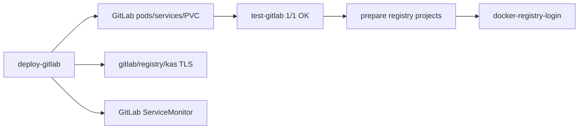

# Этап 6. GitLab и Container Registry

## Назначение этапа

На этапе разворачивается GitLab в namespace `devops`, проверяется его готовность, создаются проекты
для container registry и выполняется Docker login в `registry.pkhco.ru`.

<span style="color:#16833a"><strong>Итог этапа:</strong></span> GitLab развернут, публичные TLS
certificate resources готовы, registry projects созданы, Docker login завершился успешно.

## 6.1. Развертывание GitLab

### Команда

```bash
make deploy-gitlab ENV=vm-dev
```

### Зачем запускалась

Команда устанавливает GitLab Helm chart, создает root password secret, ingress endpoints
`gitlab.pkhco.ru`, `registry.pkhco.ru`, `kas.pkhco.ru`, ServiceMonitor для probes и TLS resources.

### Вывод: старт установки

```text
./ci/scripts/deploy-gitlab.sh vm-dev
namespace/devops configured
namespace/ci configured
secret/gitlab-root-password created
Hang tight while we grab the latest from your chart repositories...
...Successfully got an update from the "gitlab" chart repository
Update Complete. ⎈Happy Helming!⎈
Release "gitlab" does not exist. Installing it now.
NAME: gitlab
LAST DEPLOYED: Mon May  4 18:59:52 2026
NAMESPACE: devops
STATUS: deployed
REVISION: 1
DESCRIPTION: Install complete
```

## 6.2. Предупреждения GitLab Helm chart

### Зачем фиксируются

Это вывод upstream Helm chart. Он не блокирует dev-стенд, но важен для отчета по ограничениям
production-готовности.

### Вывод

```text
=== CRITICAL
The bundled PostgreSQL, Redis and MinIO will be removed in GitLab 19.0.

=== CRITICAL
The following charts are included for evaluation purposes only. They will not be supported by GitLab Support
for production workloads.
- PostgreSQL
- Redis
- Gitaly
- MinIO

=== WARNING
Automatic TLS certificate generation with cert-manager is disabled.
One or more of the components does not have a TLS certificate Secret configured.
As a result, Self-signed certificates were generated for these components.

=== WARNING
Automatic TLS certificate generation with cert-manager is disabled and no TLS certificates were provided.
Self-signed certificates were generated that do not work with gitlab-runner.

=== WARNING
The minimum required version of PostgreSQL is now 16.

=== NOTICE
You've installed GitLab Runner without the ability to use 'docker in docker'.
```

### Комментарий

Deployment-kit после установки GitLab ожидает отдельные Kubernetes `Certificate` resources:
`gitlab-wildcard-tls`, `gitlab-webservice-tls`, `gitlab-registry-tls`. В этом стенде публичные
сертификаты выдаются cert-manager через production Let's Encrypt, что подтверждается следующими
строками журнала.

## 6.3. ServiceMonitor и TLS certificates GitLab

### Вывод

```text
servicemonitor.monitoring.coreos.com/deployment-kit-gitlab-probes created
Ожидание TLS certificate devops/gitlab-wildcard-tls.
certificate.cert-manager.io/gitlab-wildcard-tls condition met
Ожидание TLS certificate devops/gitlab-webservice-tls.
certificate.cert-manager.io/gitlab-webservice-tls condition met
Ожидание TLS certificate devops/gitlab-registry-tls.
certificate.cert-manager.io/gitlab-registry-tls condition met
```

## 6.4. Проверка Pod'ов GitLab

### Вывод

```text
NAME                                              READY   STATUS      RESTARTS        AGE
pod/gitlab-gitaly-0                               1/1     Running     0               6m25s
pod/gitlab-gitlab-exporter-5f44f8984c-w8zdr       1/1     Running     0               6m26s
pod/gitlab-gitlab-runner-7488b85dd7-bfp7s         1/1     Running     2 (84s ago)     6m26s
pod/gitlab-gitlab-shell-76448f479d-7swp6          1/1     Running     0               6m10s
pod/gitlab-gitlab-shell-76448f479d-s48lp          1/1     Running     0               6m26s
pod/gitlab-kas-bf8c47cfb-2wm6k                    1/1     Running     2 (5m38s ago)   6m26s
pod/gitlab-kas-bf8c47cfb-hn4ts                    1/1     Running     3 (5m29s ago)   6m10s
pod/gitlab-migrations-99eb97b-9p87w               0/1     Completed   0               6m25s
pod/gitlab-minio-create-buckets-bbd5fec-sr9rd     0/1     Completed   0               6m25s
pod/gitlab-minio-d8b8c98f5-4mj7p                  1/1     Running     0               6m26s
pod/gitlab-postgresql-0                           2/2     Running     0               6m25s
pod/gitlab-redis-master-0                         2/2     Running     0               6m25s
pod/gitlab-registry-944c798dc-cqcnk               1/1     Running     0               6m10s
pod/gitlab-registry-944c798dc-ph8qf               1/1     Running     0               6m26s
pod/gitlab-sidekiq-all-in-1-v2-64b66f6df7-sxth4   1/1     Running     1 (105s ago)    6m26s
pod/gitlab-toolbox-ff5fc54f-rhmff                 1/1     Running     0               6m26s
pod/gitlab-webservice-default-679f768f6c-f2txk    2/2     Running     1 (2m6s ago)    6m26s
```

## 6.5. Проверка Service, Ingress и PVC GitLab

### Вывод

```text
NAME                                TYPE        CLUSTER-IP       EXTERNAL-IP   PORT(S)                               AGE
service/gitlab-gitaly               ClusterIP   None             <none>        8075/TCP,9236/TCP                     6m27s
service/gitlab-gitlab-exporter      ClusterIP   10.98.58.100     <none>        9168/TCP                              6m28s
service/gitlab-gitlab-shell         ClusterIP   10.109.59.78     <none>        22/TCP                                6m28s
service/gitlab-kas                  ClusterIP   10.107.34.175    <none>        8150/TCP,8153/TCP,8154/TCP,8151/TCP   6m28s
service/gitlab-minio-svc            ClusterIP   10.98.252.229    <none>        9000/TCP                              6m28s
service/gitlab-postgresql           ClusterIP   10.107.11.44     <none>        5432/TCP                              6m27s
service/gitlab-redis-master         ClusterIP   10.103.175.3     <none>        6379/TCP                              6m28s
service/gitlab-registry             ClusterIP   10.102.134.86    <none>        5000/TCP                              6m28s
service/gitlab-webservice-default   ClusterIP   10.104.86.145    <none>        8080/TCP,8181/TCP,8083/TCP            6m28s
```

Ingress:

```text
NAME                                                  CLASS   HOSTS               ADDRESS        PORTS     AGE
ingress.networking.k8s.io/gitlab-kas                  nginx   kas.pkhco.ru        10.101.82.92   80, 443   6m26s
ingress.networking.k8s.io/gitlab-registry             nginx   registry.pkhco.ru   10.101.82.92   80, 443   6m26s
ingress.networking.k8s.io/gitlab-webservice-default   nginx   gitlab.pkhco.ru     10.101.82.92   80, 443   6m26s
```

PVC:

```text
NAME                                                     STATUS   VOLUME                                     CAPACITY   ACCESS MODES   STORAGECLASS
persistentvolumeclaim/data-gitlab-postgresql-0           Bound    pvc-26bf8ba5-56d8-44b9-ac2e-a81539530aef   8Gi        RWO            local-path
persistentvolumeclaim/gitlab-minio                       Bound    pvc-c65c5505-1496-4878-a576-ed4339d69f7d   5Gi        RWO            local-path
persistentvolumeclaim/redis-data-gitlab-redis-master-0   Bound    pvc-ca879f3f-5fea-43ec-a8a5-101f12be8981   2Gi        RWO            local-path
persistentvolumeclaim/repo-data-gitlab-gitaly-0          Bound    pvc-086acea0-18d0-4a5f-9766-01bb35c0833a   10Gi       RWO            local-path
```

Секрет root password:

```text
GitLab root password хранится в Kubernetes secret devops/gitlab-root-password.
```

Значение пароля не выводилось и не переносится в отчет.

## 6.6. Тест GitLab

### Команда

```bash
make test-gitlab ENV=vm-dev
```

### Зачем запускалась

Команда проверяет готовность GitLab components и публичных endpoints.

### Вывод

```text
./ci/scripts/gitlab-tests.sh vm-dev

== Проверки GitLab ==
  • GitLab components and endpoints                           OK (11s)
Итог: 1/1 OK. JSON: .artifacts/vm-dev/test-results/gitlab-20260504T190757.json HTML: .artifacts/vm-dev/test-results/gitlab-20260504T190757.html
```

## 6.7. Создание GitLab проектов для registry

### Команда

```bash
make prepare-gitlab-registry-projects ENV=vm-dev
```

### Зачем запускалась

GitLab Container Registry требует существующих проектов для push образов. Команда создает group
`platform` и проекты `api`, `gateway`, `frontend`.

### Вывод

```text
./ci/scripts/prepare-gitlab-registry-projects.sh vm-dev
Подготовка GitLab registry projects через devops/gitlab-toolbox-ff5fc54f-rhmff.
Создана GitLab group platform
Создан GitLab project platform/api
Создан GitLab project platform/gateway
Создан GitLab project platform/frontend
```

## 6.8. Docker login в registry

### Команда

```bash
make docker-registry-login ENV=vm-dev
```

### Зачем запускалась

Команда проверяет авторизацию Docker CLI в `registry.pkhco.ru`, чтобы далее выполнить push
собранных образов.

### Вывод

```text
./ci/scripts/docker-registry-login.sh vm-dev
Docker trust не настраивается: registry должен иметь production Let's Encrypt сертификат.
Docker login в registry.pkhco.ru пользователем root.
Login Succeeded
```

Пароль в вывод не попал и в отчет не переносится.

## Схема этапа



## Результат этапа

<span style="color:#16833a"><strong>Успешно.</strong></span> GitLab и Container Registry готовы
для сборки и публикации demo-приложений.

