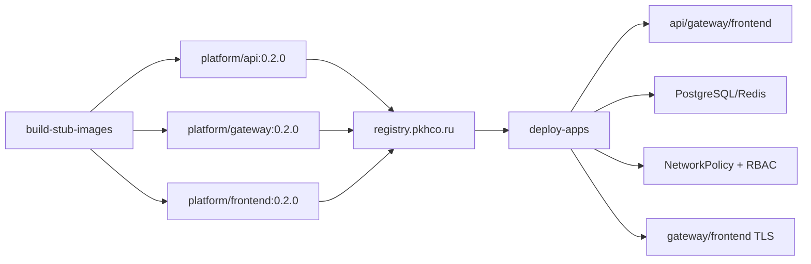

# Этап 7. Сборка образов и развертывание прикладного контура

## Назначение этапа

На этапе собираются demo-образы `api`, `gateway`, `frontend`, публикуются в GitLab Container
Registry и разворачиваются вместе с PostgreSQL, Redis, NetworkPolicy, backup CronJob,
ServiceMonitor и TLS-сертификатами.

<span style="color:#16833a"><strong>Итог этапа:</strong></span> образы `0.2.0` опубликованы в
`registry.pkhco.ru`, приложения и datastore-компоненты находятся в `Running`, TLS для
`gateway.pkhco.ru` и `app.pkhco.ru` готов.

## 7.1. Сборка и публикация образов

### Команда

```bash
APP_IMAGE_TAG=0.2.0 PUSH_IMAGES=true make build-stub-images
```

### Зачем запускалась

Команда собирает Docker images для трех demo-сервисов и публикует их в GitLab Container Registry.
Тег `0.2.0` далее используется Helm charts при деплое приложений.

## 7.2. Сборка и push API

### Вывод

```text
./ci/scripts/build-stub-images.sh
Сборка и публикация registry.pkhco.ru/platform/api:0.2.0 для linux/amd64
[+] Building 22.0s (11/11) FINISHED docker:desktop-linux
 => [internal] load build definition from Dockerfile   0.0s
 => => transferring dockerfile: 202B                   0.0s
 => [internal] load metadata for docker.io/library/node:24-alpine 1.7s
 => [internal] load .dockerignore                      0.0s
 => => transferring context: 2B                        0.0s
 => CACHED [2/4] WORKDIR /app                          0.0s
 => CACHED [3/4] COPY lib ./lib                        0.0s
 => CACHED [4/4] COPY api ./api                        0.0s
 => exporting to image                                20.2s
 => => naming to registry.pkhco.ru/platform/api:0.2.0  0.0s
 => => pushing layers                                 19.5s
 => => pushing manifest for registry.pkhco.ru/platform/api:0.2.0@sha256:b6e26ce18ca86c4761312cfb9a17def3a32b5d347c0cafe8375c765af08e4a3a 0.6s
 => [auth] platform/api:pull,push token for registry.pkhco.ru 0.0s
```

## 7.3. Сборка и push Gateway

### Вывод

```text
Сборка и публикация registry.pkhco.ru/platform/gateway:0.2.0 для linux/amd64
[+] Building 13.8s (11/11) FINISHED docker:desktop-linux
 => [internal] load build definition from Dockerfile       0.0s
 => => transferring dockerfile: 214B                       0.0s
 => [internal] load metadata for docker.io/library/node:24-alpine 0.3s
 => [internal] load .dockerignore                          0.0s
 => => transferring context: 2B                            0.0s
 => CACHED [2/4] WORKDIR /app                              0.0s
 => CACHED [3/4] COPY lib ./lib                            0.0s
 => CACHED [4/4] COPY gateway ./gateway                    0.0s
 => exporting to image                                    13.3s
 => => naming to registry.pkhco.ru/platform/gateway:0.2.0  0.0s
 => => pushing layers                                     12.7s
 => => pushing manifest for registry.pkhco.ru/platform/gateway:0.2.0@sha256:88cea3a7673ab3b3bb430718b16d96588e9df35abee8e56f7b7f66113559eb6d 0.6s
 => [auth] platform/gateway:pull,push token for registry.pkhco.ru 0.0s
```

## 7.4. Сборка и push Frontend

### Вывод

```text
Сборка и публикация registry.pkhco.ru/platform/frontend:0.2.0 для linux/amd64
[+] Building 3.9s (11/11) FINISHED docker:desktop-linux
 => [internal] load build definition from Dockerfile        0.0s
 => => transferring dockerfile: 217B                        0.0s
 => [internal] load metadata for docker.io/library/node:24-alpine 0.3s
 => [internal] load .dockerignore                           0.0s
 => => transferring context: 2B                             0.0s
 => CACHED [2/4] WORKDIR /app                               0.0s
 => CACHED [3/4] COPY lib ./lib                             0.0s
 => CACHED [4/4] COPY frontend ./frontend                   0.0s
 => exporting to image                                      3.5s
 => => naming to registry.pkhco.ru/platform/frontend:0.2.0  0.0s
 => => pushing layers                                       2.9s
 => => pushing manifest for registry.pkhco.ru/platform/frontend:0.2.0@sha256:c7acaae18cfe45be134ad68f3b3119d90a27095a015bedfc1397887479c2239a 0.6s
 => [auth] platform/frontend:pull,push token for registry.pkhco.ru 0.0s
```

### Комментарий по секретам

OAuth/registry tokens в выводе Docker BuildKit представлены только как факт авторизации `[auth]`,
значения токенов не выводились.

## 7.5. Развертывание приложений

### Команда

```bash
APP_IMAGE_TAG=0.2.0 make deploy-apps ENV=vm-dev
```

### Зачем запускалась

Команда разворачивает datastore-компоненты и demo-сервисы из только что опубликованных образов.
Перед Helm install проверяется наличие образов в registry.

### Вывод: подготовка namespace, secret и проверка образов

```text
./ci/scripts/deploy-apps.sh vm-dev
namespace/app configured
secret/gitlab-registry created
secret/postgres-auth created
Проверка наличия образа registry.pkhco.ru/platform/api:0.2.0.
Проверка наличия образа registry.pkhco.ru/platform/gateway:0.2.0.
Проверка наличия образа registry.pkhco.ru/platform/frontend:0.2.0.
```

Секреты `gitlab-registry` и `postgres-auth` созданы, их значения не выводились.

### Вывод: установка PostgreSQL, Redis и сервисов

```text
Hang tight while we grab the latest from your chart repositories...
...Successfully got an update from the "bitnami" chart repository
Update Complete. ⎈Happy Helming!⎈

Release "postgres" does not exist. Installing it now.
NAME: postgres
LAST DEPLOYED: Mon May  4 19:12:06 2026
NAMESPACE: app
STATUS: deployed
REVISION: 1
DESCRIPTION: Install complete
TEST SUITE: None

Release "redis" does not exist. Installing it now.
NAME: redis
LAST DEPLOYED: Mon May  4 19:12:36 2026
NAMESPACE: app
STATUS: deployed
REVISION: 1
DESCRIPTION: Install complete
TEST SUITE: None

Release "api" does not exist. Installing it now.
NAME: api
LAST DEPLOYED: Mon May  4 19:13:12 2026
NAMESPACE: app
STATUS: deployed
REVISION: 1
DESCRIPTION: Install complete
TEST SUITE: None

Release "gateway" does not exist. Installing it now.
NAME: gateway
LAST DEPLOYED: Mon May  4 19:13:35 2026
NAMESPACE: app
STATUS: deployed
REVISION: 1
DESCRIPTION: Install complete
TEST SUITE: None

Release "frontend" does not exist. Installing it now.
NAME: frontend
LAST DEPLOYED: Mon May  4 19:13:58 2026
NAMESPACE: app
STATUS: deployed
REVISION: 1
DESCRIPTION: Install complete
TEST SUITE: None
```

## 7.6. RBAC, NetworkPolicy, backup и rollout

### Зачем выполнялось

Deployment-kit создает отдельный ServiceAccount для деплоя приложений, политики сетевой изоляции,
PVC и CronJob для демонстрационного backup PostgreSQL.

### Вывод

```text
role.rbac.authorization.k8s.io/app-deployer created
role.rbac.authorization.k8s.io/app-reader created
serviceaccount/app-deployer created
rolebinding.rbac.authorization.k8s.io/app-deployer-binding created
networkpolicy.networking.k8s.io/allow-api-to-datastores-egress created
networkpolicy.networking.k8s.io/allow-api-to-postgres created
networkpolicy.networking.k8s.io/allow-api-to-redis created
networkpolicy.networking.k8s.io/allow-app-dns-egress created
networkpolicy.networking.k8s.io/allow-app-to-vault-egress created
networkpolicy.networking.k8s.io/allow-frontend-to-gateway-egress created
networkpolicy.networking.k8s.io/allow-frontend-to-gateway created
networkpolicy.networking.k8s.io/allow-gateway-to-api-egress created
networkpolicy.networking.k8s.io/allow-gateway-to-api created
networkpolicy.networking.k8s.io/allow-ingress-to-acme-http-solver created
networkpolicy.networking.k8s.io/allow-ingress-to-frontend created
networkpolicy.networking.k8s.io/allow-ingress-to-gateway created
networkpolicy.networking.k8s.io/allow-observability-scrape created
networkpolicy.networking.k8s.io/allow-observability-to-datastores created
networkpolicy.networking.k8s.io/default-deny created
persistentvolumeclaim/postgres-backup-pvc created
cronjob.batch/postgres-backup created
partitioned roll out complete: 1 new pods have been updated...
statefulset rolling update complete 1 pods at revision redis-master-dcdc868c8...
deployment "api" successfully rolled out
deployment "gateway" successfully rolled out
deployment "frontend" successfully rolled out
```

## 7.7. TLS и ServiceMonitor приложений

### Вывод

```text
Ожидание TLS certificate app/gateway-tls.
certificate.cert-manager.io/gateway-tls condition met
Ожидание TLS certificate app/frontend-tls.
certificate.cert-manager.io/frontend-tls condition met
servicemonitor.monitoring.coreos.com/deployment-kit-app-probes created
```

## 7.8. Итоговое состояние Pod'ов

### Вывод

```text
NAME                           READY   STATUS    RESTARTS   AGE
pod/api-576f78fbcf-z9fd2       2/2     Running   0          73s
pod/api-576f78fbcf-zvxm5       2/2     Running   0          73s
pod/frontend-b986fccdd-crrmc   2/2     Running   0          27s
pod/frontend-b986fccdd-tzf8k   2/2     Running   0          27s
pod/gateway-599c7cccfd-dphw6   2/2     Running   0          50s
pod/gateway-599c7cccfd-j8rxw   2/2     Running   0          50s
pod/postgres-postgresql-0      2/2     Running   0          2m18s
pod/redis-master-0             2/2     Running   0          109s
```

## 7.9. Итоговое состояние Service и Ingress

### Вывод

```text
NAME                                  TYPE        CLUSTER-IP       EXTERNAL-IP   PORT(S)    AGE
service/api                           ClusterIP   10.103.181.173   <none>        8081/TCP   74s
service/frontend                      ClusterIP   10.101.163.190   <none>        8080/TCP   27s
service/gateway                       ClusterIP   10.101.105.178   <none>        8080/TCP   50s
service/postgres-postgresql           ClusterIP   10.109.144.201   <none>        5432/TCP   2m18s
service/postgres-postgresql-hl        ClusterIP   None             <none>        5432/TCP   2m18s
service/postgres-postgresql-metrics   ClusterIP   10.105.191.134   <none>        9187/TCP   2m18s
service/redis-headless                ClusterIP   None             <none>        6379/TCP   109s
service/redis-master                  ClusterIP   10.103.144.227   <none>        6379/TCP   109s
service/redis-metrics                 ClusterIP   10.102.181.35    <none>        9121/TCP   110s

NAME                                 CLASS   HOSTS              ADDRESS        PORTS     AGE
ingress.networking.k8s.io/frontend   nginx   app.pkhco.ru                      80, 443   27s
ingress.networking.k8s.io/gateway    nginx   gateway.pkhco.ru   10.101.82.92   80, 443   50s
```

## Схема этапа



## Результат этапа

<span style="color:#16833a"><strong>Успешно.</strong></span> Прикладной контур развернут и готов к
приемочным проверкам.

