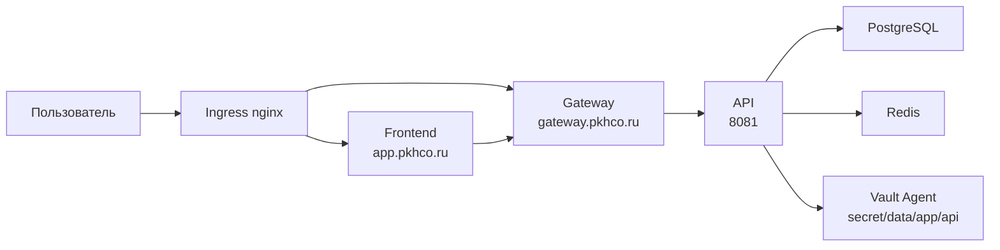

# Этап 7. Прикладной контур

## Цель этапа

Собрать демонстрационные прикладные сервисы, опубликовать образы в GitLab Container Registry и
развернуть контур приложений: PostgreSQL, Redis, API, Gateway и Frontend.

## Сборка и публикация образов

```bash
APP_IMAGE_TAG=0.2.0 PUSH_IMAGES=true make build-stub-images
```

Значимый вывод:

```text
Сборка и публикация registry.pkhco.ru/platform/api:0.2.0 для linux/amd64
pushing manifest for registry.pkhco.ru/platform/api:0.2.0

Сборка и публикация registry.pkhco.ru/platform/gateway:0.2.0 для linux/amd64
pushing manifest for registry.pkhco.ru/platform/gateway:0.2.0

Сборка и публикация registry.pkhco.ru/platform/frontend:0.2.0 для linux/amd64
pushing manifest for registry.pkhco.ru/platform/frontend:0.2.0
```

## Развертывание приложений

```bash
APP_IMAGE_TAG=0.2.0 make deploy-apps ENV=vm-dev
```

Значимый вывод:

```text
namespace/app configured
secret/gitlab-registry created
secret/postgres-auth created
Проверка наличия образа registry.pkhco.ru/platform/api:0.2.0.
Проверка наличия образа registry.pkhco.ru/platform/gateway:0.2.0.
Проверка наличия образа registry.pkhco.ru/platform/frontend:0.2.0.

Release "postgres" does not exist. Installing it now.
Release "redis" does not exist. Installing it now.
Release "api" does not exist. Installing it now.
Release "gateway" does not exist. Installing it now.
Release "frontend" does not exist. Installing it now.

deployment "api" successfully rolled out
deployment "gateway" successfully rolled out
deployment "frontend" successfully rolled out
certificate.cert-manager.io/gateway-tls condition met
certificate.cert-manager.io/frontend-tls condition met
```

## Созданные политики и задания

```text
networkpolicy.networking.k8s.io/default-deny created
networkpolicy.networking.k8s.io/allow-api-to-postgres created
networkpolicy.networking.k8s.io/allow-api-to-redis created
networkpolicy.networking.k8s.io/allow-gateway-to-api created
networkpolicy.networking.k8s.io/allow-frontend-to-gateway created
networkpolicy.networking.k8s.io/allow-app-to-vault-egress created
persistentvolumeclaim/postgres-backup-pvc created
cronjob.batch/postgres-backup created
```

## Проверка Pod'ов и Service

Значимый вывод после деплоя:

```text
pod/api-576f78fbcf-z9fd2       2/2 Running
pod/api-576f78fbcf-zvxm5       2/2 Running
pod/frontend-b986fccdd-crrmc   2/2 Running
pod/frontend-b986fccdd-tzf8k   2/2 Running
pod/gateway-599c7cccfd-dphw6   2/2 Running
pod/gateway-599c7cccfd-j8rxw   2/2 Running
pod/postgres-postgresql-0      2/2 Running
pod/redis-master-0             2/2 Running

service/api                 ClusterIP 8081/TCP
service/gateway             ClusterIP 8080/TCP
service/frontend            ClusterIP 8080/TCP
service/postgres-postgresql ClusterIP 5432/TCP
service/redis-master        ClusterIP 6379/TCP
```

## Логическая схема приложений



## Результат этапа

<span style="color:#16833a"><strong>Успешно.</strong></span> Прикладной контур развернут, образы
загружены из `registry.pkhco.ru`, сервисы имеют рабочие TLS-сертификаты через production
Let's Encrypt, NetworkPolicy применены.

