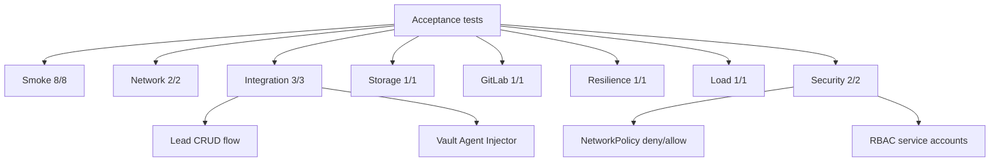

# Этап 8. Приемочное тестирование deployment-kit

## Назначение этапа

Этап подтверждает, что стенд, развернутый по runbook, работоспособен как единая система:
Kubernetes готов, ingress и TLS работают, GitLab доступен, приложения обслуживают flow лидов,
Vault Agent Injector выдает секреты, NetworkPolicy и RBAC применяются, storage работает, а gateway
выдерживает базовую нагрузку.

<span style="color:#16833a"><strong>Итог этапа:</strong></span> все тестовые наборы завершились
успешно, суммарный результат — `19/19 OK`.

## 8.1. Smoke-проверки

### Команда

```bash
make test-smoke ENV=vm-dev
```

### Зачем запускалась

Проверяет базовую готовность кластера и прикладного контура: узлы, namespace, Pod'ы, Service,
Ingress, PVC, rollout приложений, ClusterIssuer и ServiceAccount.

### Вывод

```text
./ci/scripts/smoke-tests.sh vm-dev

== Smoke-проверки ==
  • готовность узлов, namespace и Pod'ов    OK (4s)
  • прикладные Service/Ingress/PVC                  OK (2s)
  • rollout api                                               OK (0s)
  • rollout gateway                                           OK (1s)
  • rollout frontend                                          OK (0s)
  • ingress приложения                              OK (1s)
  • cluster issuers                                           OK (0s)
  • service accounts приложений                     OK (0s)
Итог: 8/8 OK. JSON: .artifacts/vm-dev/test-results/smoke-20260504T191447.json HTML: .artifacts/vm-dev/test-results/smoke-20260504T191447.html
```

## 8.2. Сетевые проверки

### Команда

```bash
make test-network ENV=vm-dev
```

### Зачем запускалась

Проверяет внутрикластерную связность и доступность внешних entrypoints через ingress.

### Вывод

```text
./ci/scripts/network-tests.sh vm-dev

== Сетевые проверки ==
  • внутрикластерная связанность   OK (52s)
  • внешние entrypoint'ы                              OK (0s)
Итог: 2/2 OK. JSON: .artifacts/vm-dev/test-results/network-20260504T191512.json HTML: .artifacts/vm-dev/test-results/network-20260504T191512.html
```

## 8.3. Интеграционные проверки

### Команда

```bash
make test-integration ENV=vm-dev
```

### Зачем запускалась

Проверяет платформенные компоненты, прикладной flow лидов и работу Vault Agent Injector.

### Вывод

```text
./ci/scripts/integration-tests.sh vm-dev

== Интеграционные проверки ==
  • платформенные компоненты           OK (12s)
  • прикладной flow лидов                      OK (23s)
  • Vault Agent Injector                                      OK (7s)
Итог: 3/3 OK. JSON: .artifacts/vm-dev/test-results/integration-20260504T191642.json HTML: .artifacts/vm-dev/test-results/integration-20260504T191642.html
```

## 8.4. Проверки хранения

### Команда

```bash
make test-storage ENV=vm-dev
```

### Зачем запускалась

Проверяет, что PVC создается, монтируется, поддерживает запись и чтение. Это важно для PostgreSQL,
Redis, Vault, GitLab и observability-компонентов.

### Вывод

```text
./ci/scripts/storage-tests.sh vm-dev

== Проверки хранения ==
  • PVC write/read                                            OK (14s)
Итог: 1/1 OK. JSON: .artifacts/vm-dev/test-results/storage-20260504T191735.json HTML: .artifacts/vm-dev/test-results/storage-20260504T191735.html
```

## 8.5. Повторная проверка GitLab

### Команда

```bash
make test-gitlab ENV=vm-dev
```

### Зачем запускалась

Повторно проверяет GitLab после развертывания registry projects и прикладного контура.

### Вывод

```text
./ci/scripts/gitlab-tests.sh vm-dev

== Проверки GitLab ==
  • GitLab components and endpoints                           OK (9s)
Итог: 1/1 OK. JSON: .artifacts/vm-dev/test-results/gitlab-20260504T191754.json HTML: .artifacts/vm-dev/test-results/gitlab-20260504T191754.html
```

## 8.6. Проверка отказоустойчивости control plane

### Команда

```bash
make test-resilience ENV=vm-dev
```

### Зачем запускалась

Проверяет health control plane, состояние узлов и готовность Kubernetes API. Тест подтверждает, что
HA control plane после bootstrap остается работоспособным.

### Вывод

```text
./ci/scripts/resilience-tests.sh vm-dev

== Проверки отказоустойчивости ==
  • control plane health                                      OK (2s)
Итог: 1/1 OK. JSON: .artifacts/vm-dev/test-results/resilience-20260504T191828.json HTML: .artifacts/vm-dev/test-results/resilience-20260504T191828.html
```

## 8.7. Нагрузочная проверка gateway

### Команда

```bash
make test-load ENV=vm-dev
```

### Зачем запускалась

Запускает k6-сценарий `gateway ramp` и проверяет, что gateway отвечает под базовой нагрузкой.

### Вывод

```text
./ci/scripts/load-test.sh vm-dev

== Нагрузочная проверка ==
  • k6 gateway ramp                                           OK (111s)
Итог: 1/1 OK. JSON: .artifacts/vm-dev/test-results/load-20260504T191856.json HTML: .artifacts/vm-dev/test-results/load-20260504T191856.html
```

## 8.8. Проверки безопасности

### Команда

```bash
make test-security ENV=vm-dev
```

### Зачем запускалась

Проверяет, что Calico NetworkPolicy реально блокирует запрещенные соединения и разрешает
ожидаемые, а ServiceAccount/RBAC для приложений настроены корректно.

### Вывод

```text
./ci/scripts/security-tests.sh vm-dev

== Проверки безопасности ==
  • NetworkPolicy deny/allow                                  OK (31s)
  • RBAC service accounts                                     OK (5s)
Итог: 2/2 OK. JSON: .artifacts/vm-dev/test-results/security-20260504T192353.json HTML: .artifacts/vm-dev/test-results/security-20260504T192353.html
```

## 8.9. Итоговая матрица

| Команда | Проверка | Результат |
| --- | --- | --- |
| `make test-smoke ENV=vm-dev` | Базовая готовность кластера и приложений | <span style="color:#16833a"><strong>8/8 OK</strong></span> |
| `make test-network ENV=vm-dev` | Сеть и внешние endpoints | <span style="color:#16833a"><strong>2/2 OK</strong></span> |
| `make test-integration ENV=vm-dev` | Platform, lead flow, Vault Agent Injector | <span style="color:#16833a"><strong>3/3 OK</strong></span> |
| `make test-storage ENV=vm-dev` | PVC write/read | <span style="color:#16833a"><strong>1/1 OK</strong></span> |
| `make test-gitlab ENV=vm-dev` | GitLab components and endpoints | <span style="color:#16833a"><strong>1/1 OK</strong></span> |
| `make test-resilience ENV=vm-dev` | Control plane health | <span style="color:#16833a"><strong>1/1 OK</strong></span> |
| `make test-load ENV=vm-dev` | k6 gateway ramp | <span style="color:#16833a"><strong>1/1 OK</strong></span> |
| `make test-security ENV=vm-dev` | NetworkPolicy и RBAC | <span style="color:#16833a"><strong>2/2 OK</strong></span> |

## 8.10. Артефакты тестирования

Каждый тест сохраняет JSON и HTML-отчет в `.artifacts/vm-dev/test-results/`. Из журнала:

```text
smoke-20260504T191447.json / smoke-20260504T191447.html
network-20260504T191512.json / network-20260504T191512.html
integration-20260504T191642.json / integration-20260504T191642.html
storage-20260504T191735.json / storage-20260504T191735.html
gitlab-20260504T191754.json / gitlab-20260504T191754.html
resilience-20260504T191828.json / resilience-20260504T191828.html
load-20260504T191856.json / load-20260504T191856.html
security-20260504T192353.json / security-20260504T192353.html
```

## Схема покрытия тестами



## Результат этапа

<span style="color:#16833a"><strong>Успешно.</strong></span> Приемочное тестирование завершено:
все тестовые наборы прошли, блокирующих ошибок не осталось.

