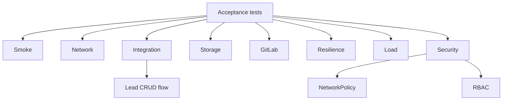

# Этап 8. Итоговое тестирование стенда

## Цель этапа

Подтвердить, что deployment-kit разворачивает работоспособный стенд целиком: Kubernetes,
платформенные сервисы, GitLab, registry, Vault, прикладной контур, сетевые ограничения,
хранилище и базовую отказоустойчивость.

## Сводная матрица проверок

| Команда | Назначение | Результат |
| --- | --- | --- |
| `make test-smoke ENV=vm-dev` | Базовая готовность узлов, namespace, Pod'ов, ingress и service accounts. | <span style="color:#16833a"><strong>8/8 OK</strong></span> |
| `make test-network ENV=vm-dev` | Внутрикластерная связность и внешние entrypoints. | <span style="color:#16833a"><strong>2/2 OK</strong></span> |
| `make test-integration ENV=vm-dev` | Платформенные компоненты, flow лидов, Vault Agent Injector. | <span style="color:#16833a"><strong>3/3 OK</strong></span> |
| `make test-storage ENV=vm-dev` | Проверка записи и чтения PVC. | <span style="color:#16833a"><strong>1/1 OK</strong></span> |
| `make test-gitlab ENV=vm-dev` | Компоненты и endpoints GitLab. | <span style="color:#16833a"><strong>1/1 OK</strong></span> |
| `make test-resilience ENV=vm-dev` | Health control plane. | <span style="color:#16833a"><strong>1/1 OK</strong></span> |
| `make test-load ENV=vm-dev` | Нагрузочная проверка gateway через k6. | <span style="color:#16833a"><strong>1/1 OK</strong></span> |
| `make test-security ENV=vm-dev` | NetworkPolicy deny/allow и RBAC service accounts. | <span style="color:#16833a"><strong>2/2 OK</strong></span> |

## Smoke-проверки

```bash
make test-smoke ENV=vm-dev
```

```text
== Smoke-проверки ==
  • готовность узлов, namespace и Pod'ов    OK (4s)
  • прикладные Service/Ingress/PVC          OK (2s)
  • rollout api                             OK (0s)
  • rollout gateway                         OK (1s)
  • rollout frontend                        OK (0s)
  • ingress приложения                      OK (1s)
  • cluster issuers                         OK (0s)
  • service accounts приложений             OK (0s)
Итог: 8/8 OK.
```

## Сетевые проверки

```bash
make test-network ENV=vm-dev
```

```text
== Сетевые проверки ==
  • внутрикластерная связанность   OK (52s)
  • внешние entrypoint'ы           OK (0s)
Итог: 2/2 OK.
```

## Интеграционные проверки

```bash
make test-integration ENV=vm-dev
```

```text
== Интеграционные проверки ==
  • платформенные компоненты   OK (12s)
  • прикладной flow лидов      OK (23s)
  • Vault Agent Injector       OK (7s)
Итог: 3/3 OK.
```

## Проверки хранения

```bash
make test-storage ENV=vm-dev
```

```text
== Проверки хранения ==
  • PVC write/read   OK (14s)
Итог: 1/1 OK.
```

## Проверки GitLab

```bash
make test-gitlab ENV=vm-dev
```

```text
== Проверки GitLab ==
  • GitLab components and endpoints   OK (9s)
Итог: 1/1 OK.
```

## Проверки отказоустойчивости

```bash
make test-resilience ENV=vm-dev
```

```text
== Проверки отказоустойчивости ==
  • control plane health   OK (2s)
Итог: 1/1 OK.
```

## Нагрузочная проверка

```bash
make test-load ENV=vm-dev
```

```text
== Нагрузочная проверка ==
  • k6 gateway ramp   OK (111s)
Итог: 1/1 OK.
```

## Проверки безопасности

```bash
make test-security ENV=vm-dev
```

```text
== Проверки безопасности ==
  • NetworkPolicy deny/allow   OK (31s)
  • RBAC service accounts      OK (5s)
Итог: 2/2 OK.
```

## Артефакты тестирования

Тестовые сценарии сохраняют результаты в `.artifacts/vm-dev/test-results/`:

```text
smoke-*.json / smoke-*.html
network-*.json / network-*.html
integration-*.json / integration-*.html
storage-*.json / storage-*.html
gitlab-*.json / gitlab-*.html
resilience-*.json / resilience-*.html
load-*.json / load-*.html
security-*.json / security-*.html
```

HTML-отчеты предназначены для визуальной проверки результатов без чтения полного консольного
лога.

## Граф покрытия проверок



## Результат этапа

<span style="color:#16833a"><strong>Успешно.</strong></span> Все контрольные тесты завершились
положительно. Суммарный результат: `19/19 OK`.

