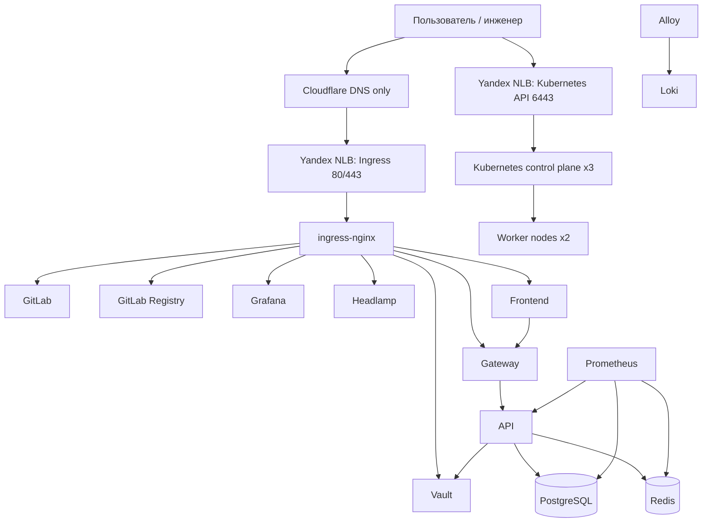

# Заключение по практической проверке

## Итог

Практическая проверка подтвердила, что deployment-kit способен автоматизированно развернуть
полный стенд `vm-dev` от подготовки облачной инфраструктуры до прикладного контура и приемочных
тестов.

## Достигнутый результат

| Направление | Результат |
| --- | --- |
| Облачная инфраструктура | Созданы сеть, подсеть, security group, пять ВМ, публичные адреса и балансировщики. |
| DNS | Поддомены `pkhco.ru` заведены в Cloudflare в режиме `DNS only`. |
| Kubernetes | Развернут HA kubeadm-кластер: 3 control plane и 2 worker узла. |
| TLS | Публичные endpoints используют production Let's Encrypt issuer `letsencrypt-prod`. |
| Platform services | Развернуты ingress-nginx, cert-manager, monitoring, logging, Headlamp. |
| Vault | Развернут Vault HA, инициализирован, настроен Kubernetes auth и KV v2 для приложений. |
| GitLab | Развернут GitLab, подготовлены registry projects, выполнен Docker login. |
| Приложения | Собраны и опубликованы образы API, Gateway, Frontend; контур успешно развернут. |
| Безопасность | NetworkPolicy и RBAC проверены автоматизированными тестами. |
| Тестирование | Все итоговые проверки завершились успешно: `19/19 OK`. |

## Финальная архитектурная картина

## Вывод

<strong>Deployment-kit прошел практическую проверку.</strong>
Набор сценариев обеспечивает воспроизводимый путь от пустого облачного окружения до работающего
Kubernetes-стенда с платформенными сервисами, GitLab, Vault, прикладными сервисами и набором
автоматизированных проверок.

