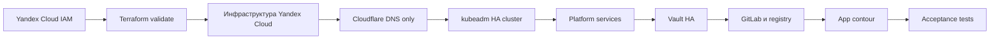

# Отчет о практическом тестировании deployment-kit

Данный каталог содержит структурированный отчет по контрольному развертыванию стенда `vm-dev`.
Исходным материалом послужил полный терминальный журнал `final_log`; в отчет перенесены только
проверяемые команды, значимые фрагменты вывода и выводы по этапам. Секреты, токены, ключи и
полные сертификаты исключены из текста отчета.

## Навигация по отчету

| Файл | Этап | Назначение |
| --- | --- | --- |
| [01-cloud-and-access.md](01-cloud-and-access.md) | Подготовка облака | Создание каталога Yandex Cloud, сервисного аккаунта и прав доступа. |
| [02-local-validation.md](02-local-validation.md) | Локальная проверка | Проверка конфигурации Terraform, Ansible и статических манифестов. |
| [03-infrastructure-and-dns.md](03-infrastructure-and-dns.md) | Инфраструктура и DNS | Создание сети, ВМ, балансировщиков и Cloudflare DNS-записей. |
| [04-kubeadm-bootstrap.md](04-kubeadm-bootstrap.md) | Kubernetes | Bootstrap HA-кластера kubeadm и проверка control plane. |
| [05-platform-and-vault.md](05-platform-and-vault.md) | Платформа и Vault | Установка ingress, cert-manager, мониторинга, админки Kubernetes и Vault. |
| [06-gitlab-registry.md](06-gitlab-registry.md) | GitLab | Развертывание GitLab, подготовка registry projects и вход в registry. |
| [07-application-contour.md](07-application-contour.md) | Прикладной контур | Сборка образов, публикация в GitLab Registry и деплой приложений. |
| [08-test-results.md](08-test-results.md) | Тестирование | Итоговые smoke, network, integration, storage, GitLab, resilience, load и security проверки. |
| [09-conclusion.md](09-conclusion.md) | Заключение | Сводный результат практической проверки и замечания к эксплуатации. |

## Легенда статусов

| Статус | Значение |
| --- | --- |
| <strong>Успешно</strong> | Этап завершен без блокирующих ошибок. |
| <strong>Предупреждение</strong> | Этап завершен, но зафиксированы ограничения или сообщения upstream-инструментов. |
| <strong>Ошибка</strong> | Этап требует исправления перед продолжением. |

## Общая последовательность работ

## Контрольные параметры стенда

| Параметр | Значение |
| --- | --- |
| Окружение | `vm-dev` |
| Домен | `pkhco.ru` |
| DNS-провайдер | Cloudflare, режим `DNS only` |
| Внешний ingress IP | `51.250.72.199` |
| Kubernetes API IP | `93.77.180.219` |
| Kubernetes version | `v1.29.3` |
| ОС узлов | Ubuntu 22.04.5 LTS |
| Runtime | containerd 2.2.1 |
| TLS | Только production Let's Encrypt через `letsencrypt-prod` |

